<style type="text/css">
body p {
  color: #000000;
}
ul {
  color: black;
}
ol {
  color: black;
}
a {
    color: darkblue;
    text-decoration: none
}
</style>

<!---
<style>
div.footnotes {
  position: absolute;
  bottom: 0;
  margin-bottom: 10px;
  width: 80%;
  font-size: 0.6em;
}
</style>

<script src="https://ajax.googleapis.com/ajax/libs/jquery/3.1.1/jquery.min.js"></script>
<script>
$(document).ready(function() {
  $('slide:not(.backdrop):not(.title-slide)').append('<div class=\"footnotes\">');

  $('footnote').each(function(index) {
    var text  = $(this).html();
    var fnNum = (index+1).toString();
    $(this).html(fnNum.sup());

    var footnote   = fnNum + '. ' + text + '<br/>';
    var oldContent = $(this).parents('slide').children('div.footnotes').html();
    var newContent = oldContent + footnote;
    $(this).parents('slide').children('div.footnotes').html(newContent);
  });
});
</script>
--->


```{r, echo = FALSE}
initialise_inds <- function(N = 200){
    ID      <- matrix(data = 0, nrow = N, ncol = 30);
    ID[,1]  <- 1:N;
    ID[,2]  <- rbinom(n = N, size = 1, prob = 0.5);
    ID[,3]  <- sample(x = 1:10, size = N, replace = TRUE);
    ID[,4]  <- sample(x = 1:10, size = N, replace = TRUE);
    ID[,5]  <- rep(x = 0, times = N);
    ID[,6]  <- rep(x = -1, times = N);
    ID[,7]  <- rep(x = -1, times = N);
    ID[,8]  <- rep(x = 0, times = N);
    ID[,9]  <- rep(x = -1, times = N);
    ID[,10] <- rep(x = 0, times = N);
    return(ID);
}

initialise_Rmat <- function(ID){
    rows <- dim(ID)[1];
    Rmat <- matrix(data = 0, nrow = rows, ncol = rows);
    diag(Rmat) <- 1;
    Rmat <- cbind(ID[,1], Rmat);
    return(Rmat);
}

Rbuild <- function(Rmat, ID, Rmat_new){
    inds <- dim(ID)[1];
    for(i in 1:inds){
        if(ID[i, 6] %in% Rmat[,1] == FALSE){
            MomP <- -1;
        }else{
            MomP <- which(Rmat[,1] == ID[i, 6]);
        }
        if(ID[i, 7] %in% Rmat[,1] == FALSE){
            DadP <- -1;
        }else{
            DadP <- which(Rmat[,1] == ID[i, 7]);
        }
        # Inbreeding coefficient
        if(MomP < 0 | DadP < 0){
            Rmat_new[i, i+1] <- 1; 
        }else{
            Rmat_new[i, i+1] <- 1 + Rmat[MomP, DadP+1]; 
        }
        # Kinship coefficient
        j <- 1;
        while(j < i){
            if(ID[j, 6] %in% Rmat[,1] == FALSE){
                Om <- -1;
            }else{
                Om <- which(Rmat[,1] == ID[j, 6]);
            }
            if(ID[j, 7] %in% Rmat[,1] == FALSE){
                Od <- -1;
            }else{
                Od <- which(Rmat[,1] == ID[j, 7]);
            }
            
            if(ID[i,5] == 0 & ID[j,5] == 0){
                if(Om < 0 | MomP < 0){
                    w <- 0;
                }else{
                    if(MomP == Om){
                        w <- 0.5 * Rmat[MomP, Om + 1];
                    }else{
                        w <- Rmat[MomP, Om + 1];
                    }
                }
                if(Od < 0 | MomP < 0){
                    y <- 0;
                }else{
                    y <- Rmat[MomP, Od + 1];
                }
                if(Om < 0 | DadP < 0){
                    x <- 0;
                }else{
                    x <- Rmat[DadP, Om + 1];
                }
                if(Od < 0 | DadP < 0){
                    z <- 0;
                }else{
                    if(DadP == Od){
                        z <- 0.5 * Rmat[DadP, Od + 1];
                    }else{
                        z <- Rmat[DadP, Od + 1];
                    }
                }
            }
            rMmuP <- 0.5 * (w + y);
            rDmuP <- 0.5 * (x + z);
            rval  <- 0.5 * (rMmuP + rDmuP);
            
            Rmat_new[i, j+1] <- rval;
            Rmat_new[j, i+1] <- rval;
            j <- j + 1;
        }
    }
    
    for(i in 1:inds){
        for(j in 1:inds){
            if(ID[i, 6] == ID[j, 1]){
                if(ID[j, 6] == -1){
                    Rmat_new[i, j+1] = 0.25;
                    Rmat_new[j, i+1] = 0.25;
                }    
            }
            if(ID[i, 7] == ID[j, 1]){
                if(ID[j, 7] == -1){
                    Rmat_new[i, j+1] = 0.25;
                    Rmat_new[j, i+1] = 0.25;
                }    
            }
        }
    }
    
    return(Rmat_new);
}

mateselect <- function(ID, Rmat_new){
    fem <- ID[ID[,2] == 0 & ID[,5] == 0,];
    mal <- ID[ID[,2] == 1 & ID[,5] == 0,];
    for(i in 1:dim(fem)[1]){
        strat <- sum(fem[i,11:20]);
        vals  <- rep(0, dim(mal)[1]);
        fpos  <- which(Rmat_new[,1] == i); 
        for(j in 1:length(vals)){
            mpos    <- which(Rmat_new[,1] == j);
            kval    <- Rmat_new[i, j+1];
            vals[j] <- kval * strat;
        }
        if(strat < 0){
            weight <- 1 / (1 + (-1 * vals));
            probs  <- weight / sum(weight);
        }else{
            weight <- 1 + vals;
            probs  <- weight / sum(weight);
        }
        mate    <- sample(x = 1:dim(mal)[1], size = 1, pr = probs);
        mateID  <- mal[mate,1];
        matepos <- which(ID[,1] == mateID);
        ownID   <- fem[i, 1];
        ownpos  <- which(ID[,1] == ownID);
        ID[ownpos, 9]  <- mateID;
        ID[matepos, 9] <- ownID;
    }
    return(ID);
}

make_offspring <- function(ID, Rmat_new, nn = 6){
    start_ID <- max(ID[,1]) + 1;
    for(i in 1:dim(ID)[1]){
        if(ID[i, 2] == 0 & ID[i, 9] > 0 & ID[i, 5] == 0){
            mum    <- ID[i,];
            dadpos <- which(ID[,1] == ID[i, 9]);
            dad    <- ID[dadpos,];
            offs   <- matrix(data = 0, nrow = nn, ncol = dim(ID)[2]);
            offs[,1] <- start_ID:(start_ID+nn-1);
            start_ID <- start_ID + nn;
            offs[,2] <- rbinom(n = nn, size = 1, prob = 0.5);
            offs[,3] <- mum[3];
            offs[,4] <- mum[4];
            offs[,6] <- mum[1];
            offs[,7] <- dad[1];
            mrpos    <- which(Rmat_new[,1] == mum[1]);
            drpos    <- which(Rmat_new[,1] == dad[1]);
            offs[,8] <- Rmat_new[mrpos, drpos+1];
            offs[,11:30] <- mum[11:30];
            dum_vec  <- rbinom(n = length(offs[,11:30]), size = 1, prob = 0.5);
            dummy    <- matrix(data = dum_vec, nrow = dim(offs)[1]);
            dummy[dummy > 0] <- NA;
            
        }
    }
}

produce_offs <- function(ID, Rmat_new, nn){
    # NOTE: This toy model has unrealistic recombination between parents!
    mums  <- sum(ID[,2] == 0 & ID[, 5] == 0 & ID[, 9] != 0);
    offs  <- matrix(data = 0, nrow = mums * nn, ncol = dim(ID)[2]);
    start <- 1;
    for(i in 1:dim(ID)[1]){  # Unrealistic recombination saves some time.
        if(ID[i,2] == 0 & ID[i, 5] == 0 & ID[i, 9] != 0){
            her_off     <- matrix(data = ID[i,], nrow = nn, ncol = dim(ID)[2], 
                                  byrow = TRUE);
            her_off[,2] <- rbinom(n = nn, size = 1, prob = 0.5);
            her_off[,6] <- ID[i,1];
            her_off[,7] <- ID[i,9];
            mum_p       <- which(Rmat_new[,1] == ID[i,1]);
            dad_p       <- which(Rmat_new[,1] == ID[i,9]);
            her_off[,8] <- Rmat_new[mum_p, dad_p + 1];
            her_off[,9] <- -1;
            dad_o       <- which(ID[,1] == ID[i,9]);
            dad_overlay <- matrix(data = ID[dad_o,], nrow = nn, 
                                  ncol = dim(ID)[2], byrow = TRUE);
            to_vec      <- rbinom(n = nn*dim(ID)[2], size = 1, prob = 0.5);
            to_overlay  <- matrix(data = to_vec, nrow = nn);
            to_overlay[,1:10] <- 1;
            her_off[to_overlay < 1] <- NA;
            her_off[is.na(her_off)] <- dad_overlay[is.na(her_off)];
            offs[start:(start+(nn-1)), 1:dim(ID)[2]] <- her_off;
            start <- start + nn;
        }
    }
    max_ID   <- max(ID[,1]);
    offs[,1] <- (max_ID + 1):(max_ID + dim(offs)[1]); 
    return(offs);
}

mortality <- function(offs, beta){
    depression        <- exp(-1 * beta * offs[,8]);
    alive             <- rbinom(n = dim(offs)[1], size = 1, prob = depression);
    offs[alive < 1,5] <- -1;
    offs              <- offs[offs[,5] > -1,];
    return(offs);
}

mutation  <- function(offs, mu){
    mutations <- rbinom(n = 20*dim(offs)[1], size = 1, prob = mu);
    tot_mut   <- sum(mutations);
    mut_mat   <- matrix(data = mutations, nrow = dim(offs)[1]);
    mu_eff    <- rnorm(n = tot_mut, mean = 0, sd = 2);
    mut_mat[mut_mat > 0] <- mu_eff;
    offs[,11:30] <- offs[,11:30] + mut_mat;
    return(offs);
}

retain <- function(ID, offs){
    retainers <- rep(x = 0, times = dim(ID)[1]);
    for(i in 1:dim(ID)[1]){
        ID_num <- ID[i, 1];
        ismum  <- sum(offs[,6] == ID_num);
        isdad  <- sum(offs[,7] == ID_num);
        ispar  <- ismum + isdad;
        if(ispar < 1){
            retainers[i] <- 1;
        }
    }
    to_remove <- which(retainers == 1);
    ID <- ID[-to_remove,];
    return(ID);
}

get_stats <- function(ID){
    mean_inbr <- mean(ID[,8]);
    mean_aval <- mean(ID[,11:20]);
    sd_aval   <- sd(ID[,11:20]);
    mean_nval <- mean(ID[,21:30]);
    sd_nval   <- sd(ID[,21:30]);
    stat_vec  <- c(mean_inbr, mean_aval, sd_aval, mean_nval, sd_nval);
    return(stat_vec);
}

immigration <- function(ID, imm, IDst){
    max_ID     <- max(ID[,1]);
    immigrants <- initialise_inds(N = imm);
    avalues    <- rnorm(n = 10 * imm, mean = IDst[2], sd = IDst[3]);
    nvalues    <- rnorm(n = 10 * imm, mean = IDst[4], sd = IDst[5]);
    a_mat      <- matrix(data = avalues, nrow = imm);
    n_mat      <- matrix(data = nvalues, nrow = imm);
    immigrants[,2]     <- 1;
    immigrants[,11:20] <- a_mat;
    immigrants[,21:30] <- n_mat;
    imm_IDs            <- (max_ID + 1):(max_ID + imm);
    immigrants[,1]     <- imm_IDs;
    ID <- rbind(ID, immigrants);
    return(ID);
}

new_gen <- function(ID, Rmat, cost = 0, imm = 5, beta = 1, 
                    mu = 0.01, Kf = 100, Km = 100, nn = 6){
    N       <- dim(ID)[1];
    death   <- rep(x = 0, times = N);
    females <- sum(ID[,2] == 0 & ID[,5] <= 1);
    males   <- sum(ID[,2] == 1 & ID[,5] <= 1);
    strat   <- apply(X = ID[,11:20], MARGIN = 1, FUN = sum);
    strat_c <- abs(strat) * cost;
    strat_d <- rbinom(n = N, size = 1, prob = strat_c);
    death   <- death + strat_d;
    death   <- death + (ID[,5] > 1);
    ID[,5]  <- -1 * death;
    ID      <- ID[order(ID[,2], decreasing = FALSE),];
    ID      <- ID[order(ID[,5], decreasing = FALSE),];
    livef   <- sum(ID[,2] == 0 & ID[,5] < 2 & ID[,5] > -1);
    livem   <- sum(ID[,2] == 1 & ID[,5] < 2 & ID[,5] > -1);
    if(livef > Kf){
        rm   <- livef - Kf;
        rows <- which(ID[,2] == 0 & ID[,5] < 2 & ID[,5] > -1);
        ID[rows[1:rm],5] <- -1;
    }
    if(livem > Km){
        rm   <- livem - Km;
        rows <- which(ID[,2] == 1 & ID[,5] < 2 & ID[,5] > -1);
        ID[rows[1:rm],5] <- -1;
    }
    ID <- rbind(ID[ID[,5] >= 0,], ID[ID[,5] < 0,]);
    
    Rmat_new <- initialise_Rmat(ID);
    Rmat_new <- Rbuild(Rmat, ID, Rmat_new);
    
    ID   <- mateselect(ID, Rmat_new);
    offs <- produce_offs(ID, Rmat_new, nn);
    offs <- mortality(offs, beta);
    offs <- mutation(offs, mu);
    IDst <- get_stats(ID);
    
    lgn  <- ID[ID[,5] == 0,];
    
    ID[ID[,5] >= 0, 5] <- -1;
    
    ID <- retain(ID, offs);
    ID <- rbind(ID, offs);
    
    ID <- immigration(ID, imm, IDst);
    
    results <- list(ID = ID, Rmat = Rmat_new, stats = IDst, last_gen = lgn);
    return(results);
}

mate_connect <- function(ID){
    living     <- ID[ID[,5] == 0,];
    fem_count  <- sum(living[,2] == 0);
    mal_count  <- sum(living[,2] == 1);
    livsor     <- living[order(living[,2]),];
    livsor[,3] <- 1:dim(livsor)[1];
    pointpairs <- matrix(data = 0, nrow = dim(livsor)[1], ncol = 8);
    pointpairs[,1] <- livsor[,1];
    for(i in 1:dim(livsor)[1]){
        if(livsor[i, 2] == 0){
            femID <- livsor[i, 1];
            malID <- livsor[i, 9];
            femps <- i;
            malps <- which(livsor[,1] == malID);
            pointpairs[i, 2] <- malID;
        }
    }
    pointpairs[,3] <- 1:dim(pointpairs)[1];
    distr <- seq(from = 0, to = 2*pi, length.out = dim(pointpairs)[1]);
    for(i in 1:dim(pointpairs)[1]){
        xplace            <- 2 * cos(distr[pointpairs[i, 3]]);
        yplace            <- 2 * sin(distr[pointpairs[i, 3]]);
        pointpairs[i, 5]  <- xplace;
        pointpairs[i, 6]  <- yplace;
    }
    for(i in 1:dim(pointpairs)[1]){
        if(i <= fem_count){
            matepos           <- which(pointpairs[,1] == pointpairs[i, 2]);
            pointpairs[i, 4]  <- matepos;
            pointpairs[i, 7]  <- pointpairs[matepos, 5];
            pointpairs[i, 8]  <- pointpairs[matepos, 6];
        }
    }
    return(pointpairs);
}
```

## Inbreeding and its consequences for evolution {.smaller}

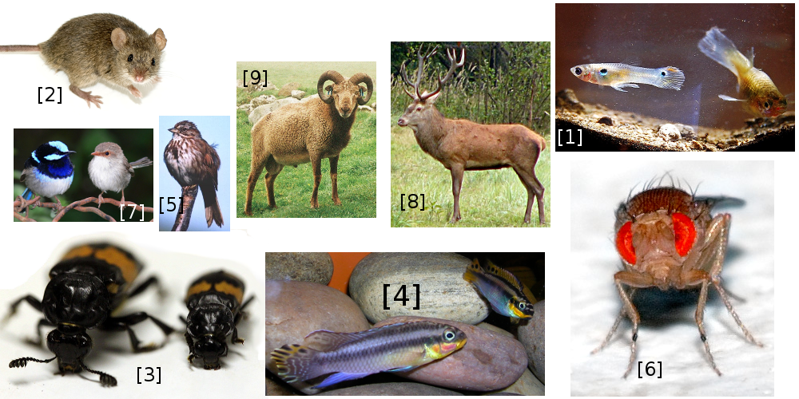

<div align="left" style="line-height: 0.6em;">
<span style="font-size: 14px;">
1. [Wibowo Djatmiko](https://commons.wikimedia.org/wiki/User:Wie146). 2. [George Shuklin](https://commons.wikimedia.org/wiki/User:George_Shuklin). 3. [Natalie Pilakouta](https://www.nataliepilakouta.com/). 4. [Neale Monks](https://en.wikipedia.org/wiki/User:Neale_Monks). 5. [Jane Reid](https://www.abdn.ac.uk/ibes/profiles/jane.reid). 6. [André Karwath](https://commons.wikimedia.org/wiki/User:Aka). <br> 7. [Benjamin Twist](https://commons.wikimedia.org/wiki/User:Benjamint444) (benjamint444@gmail.com) 8. [Heinz Seehagel](https://de.wikipedia.org/wiki/Benutzer:HaSee). 9. [Adam Hayward](https://adhayward.wordpress.com/)
</span></div>

## **Avoidance** of breeding with relatives


<div align="left" style="line-height: 0.6em;">
<span style="font-size: 14px;"><br>
Szulkin M, et al. (2013) *Trends Ecol. Evol.* [**28**:205–211](https://doi.org/10.1016/j.tree.2012.10.016). 
Images: [A. C. Duthie](catherineduthiearts@gmail.com)
</span></div>

## **Preference** for breeding with relatives


<div align="left" style="line-height: 0.6em;">
<span style="font-size: 14px;"><br>
Szulkin M, et al. (2013) *Trends Ecol. Evol.* [**28**:205–211](https://doi.org/10.1016/j.tree.2012.10.016).
Images: [A. C. Duthie](catherineduthiearts@gmail.com)
</span></div>

## No inbreeding avoidance/preference (**Tolerance**)


<div align="left" style="line-height: 0.6em;">
<span style="font-size: 14px;"><br>
Szulkin M, et al. (2013) *Trends Ecol. Evol.* [**28**:205–211](https://doi.org/10.1016/j.tree.2012.10.016).
Images: [A. C. Duthie](catherineduthiearts@gmail.com)
</span></div>

## Biparental inbreeding theory

<div class = "columns-2">


**Predict when inbreeding avoidance, preference, and tolerance will occur in obligately biparental diploid populations**

</div>

<br><br>

<hr>

Monster images: [http://cliparts.co](http://cliparts.co)


## Pedigrees and coefficients affecting inbreeding

<center>

</center>

## Pedigrees and coefficients affecting inbreeding

<center>
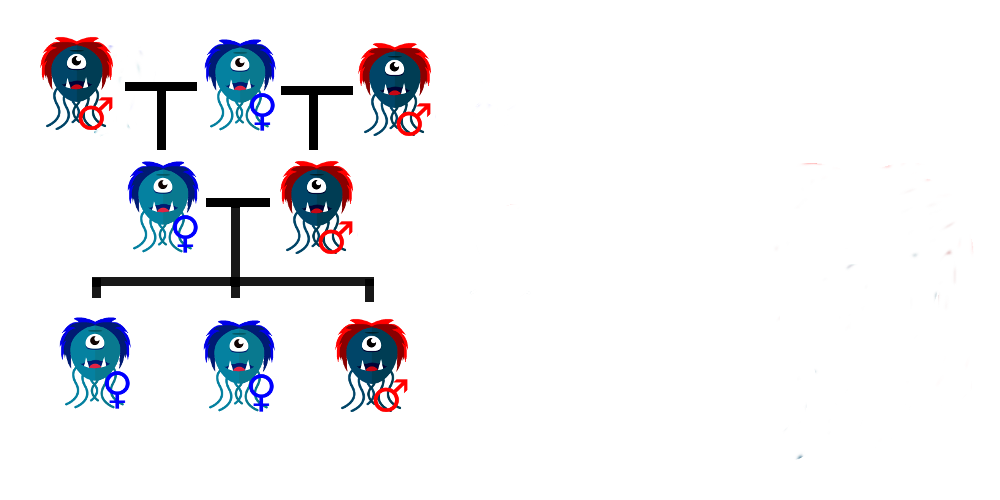
</center>

## Pedigrees and coefficients affecting inbreeding

<center>
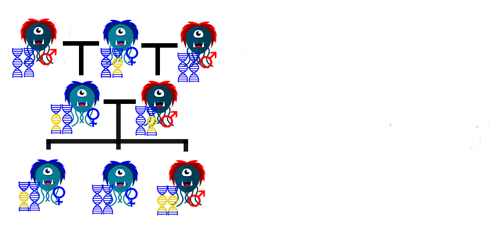
</center>

## Pedigrees and coefficients affecting inbreeding

<center>

</center>

## Pedigrees and coefficients affecting inbreeding

<center>

</center>

## Pedigrees and coefficients affecting inbreeding

<center>

</center>

## Pedigrees and coefficients affecting inbreeding

<center>

</center>

## Pedigrees and coefficients affecting inbreeding

<center>

</center>

## Pedigrees and coefficients affecting inbreeding

<center>

</center>

## Pedigrees and coefficients affecting inbreeding

<center>

</center>

## Pedigrees and coefficients affecting inbreeding

<center>

</center>


## Encounter between relatives

<center>

</center>

<div align="left" style="line-height: 0.6em;">
<span style="font-size: 14px;"><br>
Parker (1979) *Sexual selection and reproductive competition in insects* (pp. 123–166). Parker (2006) *Philos. Trans. Royal Soc. B.* [**361**:235-259](https://doi.org/10.1098/rstb.2005.1785).
</span></div>

## Encounter between relatives

<center>
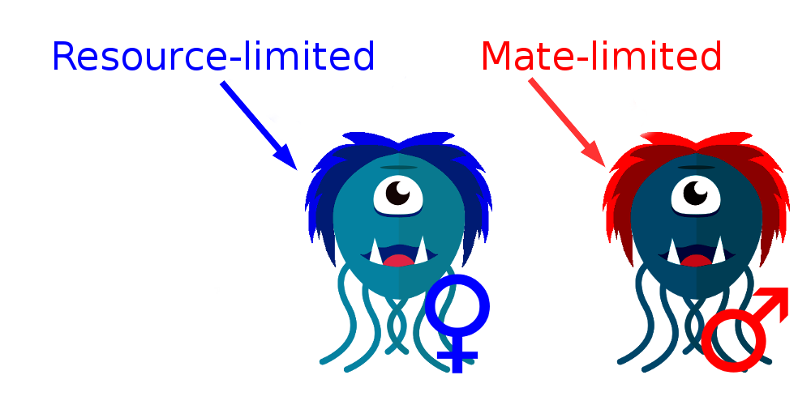
</center>

<div align="left" style="line-height: 0.6em;">
<span style="font-size: 14px;"><br>
Parker (1979) *Sexual selection and reproductive competition in insects* (pp. 123–166). Parker (2006) *Philos. Trans. Royal Soc. B.* [**361**:235-259](https://doi.org/10.1098/rstb.2005.1785).
</span></div>

## Encounter between relatives

<center>


</center>
<div align="left" style="line-height: 0.6em;">
<span style="font-size: 14px;"><br>
Parker (1979) *Sexual selection and reproductive competition in insects* (pp. 123–166). Parker (2006) *Philos. Trans. Royal Soc. B.* [**361**:235-259](https://doi.org/10.1098/rstb.2005.1785).
</span></div>

## Encounter between relatives

<center>


</center>
<div align="left" style="line-height: 0.6em;">
<span style="font-size: 14px;"><br>
Parker (1979) *Sexual selection and reproductive competition in insects* (pp. 123–166). Parker (2006) *Philos. Trans. Royal Soc. B.* [**361**:235-259](https://doi.org/10.1098/rstb.2005.1785).
</span></div>


## Encounter between relatives

<center>


</center>
<div align="left" style="line-height: 0.6em;">
<span style="font-size: 14px;"><br>
Parker (1979) *Sexual selection and reproductive competition in insects* (pp. 123–166). Parker (2006) *Philos. Trans. Royal Soc. B.* [**361**:235-259](https://doi.org/10.1098/rstb.2005.1785).
</span></div>


## Key conceptual take-aways

<div class = "columns-2">

```{r, echo = FALSE, fig.width = 4.5}
ri <- matrix(data=c(1,0.5,0,0.5,1,0,0,0,1),nrow=3,byrow=TRUE);
Inbreed <- function(focal,mate,alt){
  Inb <- ri[focal,focal] + ri[focal,mate];
  Out <- ri[focal,mate]  + ri[focal,alt];
  DEL <- 1 - (Out/Inb);
  return(DEL);
}
rs <- seq(from=0,to=1,by=0.0001);
dl <- rep(x=0,length=length(rs));
for(i in 1:length(rs)){
  ri <- matrix(data=c(1,rs[i],0,rs[i],1,0,0,0,1),nrow=3,byrow=TRUE);
  dl[i] <- Inbreed(focal=1,mate=2,alt=3);
}
par(mar=c(5,5,1,1));
plot(x=rs,y=dl,type="l",lwd=2,
  xlab=expression(paste("Relatedness (",italic(r),")")),
  ylab=expression(paste(italic(delta)," threshold")),
  cex.lab=1.5,cex.axis=1.25,ylim=c(0,1));
Inbreed <- function(focal,mate,alt){
  Inb <- ri[focal,focal] + ri[focal,mate];
  Out <- ri[focal,focal]  + ri[focal,alt];
  DEL <- 1 - (Out/Inb);
  return(DEL);
}
dk <- rep(x=0,length=length(rs));
for(i in 1:length(rs)){
  ri <- matrix(data=c(1,rs[i],0,rs[i],1,0,0,0,1),nrow=3,byrow=TRUE);
  dk[i] <- Inbreed(focal=2,mate=1,alt=3);
}
points(x=rs,y=dk,type="l",lwd=2,
  cex.lab=1.25,cex.axis=1.5,ylim=c(0,1));
polygon(x=c(rs,rev(rs)),y=c(dk,rev(dl)),col="black");
polygon(x=c(rs,rev(rs)),y=c(rep(0,length(dk)),rev(dk)),col="grey40");
points(x=seq(from=0,to=1,by=0.1),y=rep(1,11),type="l");
points(y=seq(from=0,to=1,by=0.1),x=rep(1,11),type="l");
text(x=0.75,y=0.16,labels=expression(paste(italic(Female))),cex=1.75, col = "black");
arrows(x0=0.75,y0=0.2,x1=0.6,y1=0.375, length = 0.15, angle = 30, code = 2, lwd=2);
text(x=0.75,y=0.84,labels=expression(paste(italic(Male))),cex=1.75, col  = "black");
arrows(x0=0.75,y0=0.8,x1=0.6,y1=0.625, length = 0.15, angle = 30, code = 2, lwd=2);
```


Inbreeding avoidance is predicted given a sufficiently high threshold of inbreeding depression [1,2]

Inbreeding depression thresholds differ between females and males causing sexual conflict [1,2]

**Female threshold:**

$$1 > (1+r)(1-\delta)$$

**Male threshold:**

$$r > (1+r)(1-\delta)$$

</div>

<hr>

<div align="left" style="line-height: 0.6em;">
<span style="font-size: 14px;">
[1] Parker (1979) *Sexual selection and reproductive competition in insects* (pp. 123–166).
[2] Parker (2006) *Philos. Trans. Royal Soc. B.* [**361**:235-259](https://doi.org/10.1098/rstb.2005.1785). 
</span></div>

## Key conceptual take-aways

<div class = "columns-2">

```{r, echo = FALSE, fig.width = 4.5}
ri <- matrix(data=c(1,0.5,0,0.5,1,0,0,0,1),nrow=3,byrow=TRUE);
Inbreed <- function(focal,mate,alt){
  Inb <- ri[focal,focal] + ri[focal,mate];
  Out <- ri[focal,mate]  + ri[focal,alt];
  DEL <- 1 - (Out/Inb);
  return(DEL);
}
rs <- seq(from=0,to=1,by=0.0001);
dl <- rep(x=0,length=length(rs));
for(i in 1:length(rs)){
  ri <- matrix(data=c(1,rs[i],0,rs[i],1,0,0,0,1),nrow=3,byrow=TRUE);
  dl[i] <- Inbreed(focal=1,mate=2,alt=3);
}
par(mar=c(5,5,1,1));
plot(x=rs,y=dl,type="l",lwd=2,
  xlab=expression(paste("Relatedness (",italic(r),")")),
  ylab=expression(paste(italic(delta)," threshold")),
  cex.lab=1.5,cex.axis=1.25,ylim=c(0,1));
Inbreed <- function(focal,mate,alt){
  Inb <- ri[focal,focal] + ri[focal,mate];
  Out <- ri[focal,focal]  + ri[focal,alt];
  DEL <- 1 - (Out/Inb);
  return(DEL);
}
dk <- rep(x=0,length=length(rs));
for(i in 1:length(rs)){
  ri <- matrix(data=c(1,rs[i],0,rs[i],1,0,0,0,1),nrow=3,byrow=TRUE);
  dk[i] <- Inbreed(focal=2,mate=1,alt=3);
}
points(x=rs,y=dk,type="l",lwd=2,
  cex.lab=1.25,cex.axis=1.5,ylim=c(0,1));
polygon(x=c(rs,rev(rs)),y=c(dk,rev(dl)),col="black");
polygon(x=c(rs,rev(rs)),y=c(rep(0,length(dk)),rev(dk)),col="grey40");
points(x=seq(from=0,to=1,by=0.1),y=rep(1,11),type="l");
points(y=seq(from=0,to=1,by=0.1),x=rep(1,11),type="l");
text(x=0.75,y=0.16,labels=expression(paste(italic(Female))),cex=1.75, col = "black");
arrows(x0=0.75,y0=0.2,x1=0.6,y1=0.375, length = 0.15, angle = 30, code = 2, lwd=2);
text(x=0.75,y=0.84,labels=expression(paste(italic(Male))),cex=1.75, col  = "black");
arrows(x0=0.75,y0=0.8,x1=0.6,y1=0.625, length = 0.15, angle = 30, code = 2, lwd=2);
```


Inbreeding avoidance is predicted given a sufficiently high threshold of inbreeding depression [1,2]

Inbreeding depression thresholds differ between females and males causing sexual conflict [1,2]

**Above** thresholds we predict inbreeding avoidance 

**Below** thresholds we predict inbreeding preference (females) or tolerance (males) [3,4]

</div>

<hr>

<div align="left" style="line-height: 0.6em;">
<span style="font-size: 14px;">
[1] Parker (1979) *Sexual selection and reproductive competition in insects* (pp. 123–166). 
[2] Parker (2006) *Philos. Trans. Royal Soc. B.* [**361**:235-259](https://doi.org/10.1098/rstb.2005.1785). <br>
[3] Puurtinen (2011) *Evolution* [**65**:1501-1505](https://doi.org/10.1111/j.1558-5646.2010.01217.x).
[4] Duthie, AB & JM Reid (2016) *Am. Nat.* [188:651-667](https://bradduthie.github.io/Duthie_Reid2016.pdf).

</span></div>

## Key conceptual take-aways

<div class = "columns-2">

```{r, echo = FALSE, fig.width = 4.5}
ri <- matrix(data=c(1,0.5,0,0.5,1,0,0,0,1),nrow=3,byrow=TRUE);
Inbreed <- function(focal,mate,alt){
  Inb <- ri[focal,focal] + ri[focal,mate];
  Out <- ri[focal,mate]  + ri[focal,alt];
  DEL <- 1 - (Out/Inb);
  return(DEL);
}
rs <- seq(from=0,to=1,by=0.0001);
dl <- rep(x=0,length=length(rs));
for(i in 1:length(rs)){
  ri <- matrix(data=c(1,rs[i],0,rs[i],1,0,0,0,1),nrow=3,byrow=TRUE);
  dl[i] <- Inbreed(focal=1,mate=2,alt=3);
}
par(mar=c(5,5,1,1));
plot(x=rs,y=dl,type="l",lwd=2,
  xlab=expression(paste("Relatedness (",italic(r),")")),
  ylab=expression(paste(italic(delta)," threshold")),
  cex.lab=1.5,cex.axis=1.25,ylim=c(0,1));
Inbreed <- function(focal,mate,alt){
  Inb <- ri[focal,focal] + ri[focal,mate];
  Out <- ri[focal,focal]  + ri[focal,alt];
  DEL <- 1 - (Out/Inb);
  return(DEL);
}
dk <- rep(x=0,length=length(rs));
for(i in 1:length(rs)){
  ri <- matrix(data=c(1,rs[i],0,rs[i],1,0,0,0,1),nrow=3,byrow=TRUE);
  dk[i] <- Inbreed(focal=2,mate=1,alt=3);
}
points(x=rs,y=dk,type="l",lwd=2,
  cex.lab=1.25,cex.axis=1.5,ylim=c(0,1));
polygon(x=c(rs,rev(rs)),y=c(dk,rev(dl)),col="black");
polygon(x=c(rs,rev(rs)),y=c(rep(0,length(dk)),rev(dk)),col="grey40");
points(x=seq(from=0,to=1,by=0.1),y=rep(1,11),type="l");
points(y=seq(from=0,to=1,by=0.1),x=rep(1,11),type="l");
text(x=0.75,y=0.16,labels=expression(paste(italic(Female))),cex=1.75, col = "black");
arrows(x0=0.75,y0=0.2,x1=0.6,y1=0.375, length = 0.15, angle = 30, code = 2, lwd=2);
text(x=0.75,y=0.84,labels=expression(paste(italic(Male))),cex=1.75, col  = "black");
arrows(x0=0.75,y0=0.8,x1=0.6,y1=0.625, length = 0.15, angle = 30, code = 2, lwd=2);
```
 

Inbreeding tolerance increases with lower encounter rates [1].

</div>

<hr>

<div align="left" style="line-height: 0.6em;">
<span style="font-size: 14px;">
[1] Kokko, H & I Ots (2006) *Evolution* [**60**:467-475](http://onlinelibrary.wiley.com/doi/10.1111/j.0014-3820.2006.tb01128.x/abstract).
</span></div>

## Key conceptual take-aways

<div class = "columns-2">

```{r, echo = FALSE, fig.width = 4.5}
ri <- matrix(data=c(1,0.5,0,0.5,1,0,0,0,1),nrow=3,byrow=TRUE);
Inbreed <- function(focal,mate,alt){
  Inb <- ri[focal,focal] + ri[focal,mate];
  Out <- ri[focal,mate]  + ri[focal,alt];
  DEL <- 1 - (Out/Inb);
  return(DEL);
}
rs <- seq(from=0,to=1,by=0.0001);
dl <- rep(x=0,length=length(rs));
for(i in 1:length(rs)){
  ri <- matrix(data=c(1,rs[i],0,rs[i],1,0,0,0,1),nrow=3,byrow=TRUE);
  dl[i] <- Inbreed(focal=1,mate=2,alt=3);
}
par(mar=c(5,5,1,1));
plot(x=rs,y=dl,type="l",lwd=2,
  xlab=expression(paste("Relatedness (",italic(r),")")),
  ylab=expression(paste(italic(delta)," threshold")),
  cex.lab=1.5,cex.axis=1.25,ylim=c(0,1));
Inbreed <- function(focal,mate,alt){
  Inb <- ri[focal,focal] + ri[focal,mate];
  Out <- ri[focal,focal]  + ri[focal,alt];
  DEL <- 1 - (Out/Inb);
  return(DEL);
}
dk <- rep(x=0,length=length(rs));
for(i in 1:length(rs)){
  ri <- matrix(data=c(1,rs[i],0,rs[i],1,0,0,0,1),nrow=3,byrow=TRUE);
  dk[i] <- Inbreed(focal=2,mate=1,alt=3);
}
points(x=rs,y=dk,type="l",lwd=2,
  cex.lab=1.25,cex.axis=1.5,ylim=c(0,1));
polygon(x=c(rs,rev(rs)),y=c(dk,rev(dl)),col="black");
polygon(x=c(rs,rev(rs)),y=c(rep(0,length(dk)),rev(dk)),col="grey40");
points(x=seq(from=0,to=1,by=0.1),y=rep(1,11),type="l");
points(y=seq(from=0,to=1,by=0.1),x=rep(1,11),type="l");
text(x=0.75,y=0.16,labels=expression(paste(italic(Female))),cex=1.75, col = "black");
arrows(x0=0.75,y0=0.2,x1=0.6,y1=0.375, length = 0.15, angle = 30, code = 2, lwd=2);
text(x=0.75,y=0.84,labels=expression(paste(italic(Male))),cex=1.75, col  = "black");
arrows(x0=0.75,y0=0.8,x1=0.6,y1=0.625, length = 0.15, angle = 30, code = 2, lwd=2);
```


Inbreeding tolerance increases with lower encounter rates [1].

Inbreeding avoidance or preference can affect dispersal [2].

</div>

<hr>

<div align="left" style="line-height: 0.6em;">
<span style="font-size: 14px;">
[1] Kokko, H & I Ots (2006) *Evolution* [**60**:467-475](http://onlinelibrary.wiley.com/doi/10.1111/j.0014-3820.2006.tb01128.x/abstract).
[2] Lehmann, L & N Perrin (2003) *Am. Nat.* [**162**:638-652](https://www.journals.uchicago.edu/doi/10.1086/378823). <br>
</span></div>

## Key conceptual take-aways

<div class = "columns-2">

```{r, echo = FALSE, fig.width = 4.5}
ri <- matrix(data=c(1,0.5,0,0.5,1,0,0,0,1),nrow=3,byrow=TRUE);
Inbreed <- function(focal,mate,alt){
  Inb <- ri[focal,focal] + ri[focal,mate];
  Out <- ri[focal,mate]  + ri[focal,alt];
  DEL <- 1 - (Out/Inb);
  return(DEL);
}
rs <- seq(from=0,to=1,by=0.0001);
dl <- rep(x=0,length=length(rs));
for(i in 1:length(rs)){
  ri <- matrix(data=c(1,rs[i],0,rs[i],1,0,0,0,1),nrow=3,byrow=TRUE);
  dl[i] <- Inbreed(focal=1,mate=2,alt=3);
}
par(mar=c(5,5,1,1));
plot(x=rs,y=dl,type="l",lwd=2,
  xlab=expression(paste("Relatedness (",italic(r),")")),
  ylab=expression(paste(italic(delta)," threshold")),
  cex.lab=1.5,cex.axis=1.25,ylim=c(0,1));
Inbreed <- function(focal,mate,alt){
  Inb <- ri[focal,focal] + ri[focal,mate];
  Out <- ri[focal,focal]  + ri[focal,alt];
  DEL <- 1 - (Out/Inb);
  return(DEL);
}
dk <- rep(x=0,length=length(rs));
for(i in 1:length(rs)){
  ri <- matrix(data=c(1,rs[i],0,rs[i],1,0,0,0,1),nrow=3,byrow=TRUE);
  dk[i] <- Inbreed(focal=2,mate=1,alt=3);
}
points(x=rs,y=dk,type="l",lwd=2,
  cex.lab=1.25,cex.axis=1.5,ylim=c(0,1));
polygon(x=c(rs,rev(rs)),y=c(dk,rev(dl)),col="black");
polygon(x=c(rs,rev(rs)),y=c(rep(0,length(dk)),rev(dk)),col="grey40");
points(x=seq(from=0,to=1,by=0.1),y=rep(1,11),type="l");
points(y=seq(from=0,to=1,by=0.1),x=rep(1,11),type="l");
text(x=0.75,y=0.16,labels=expression(paste(italic(Female))),cex=1.75, col = "black");
arrows(x0=0.75,y0=0.2,x1=0.6,y1=0.375, length = 0.15, angle = 30, code = 2, lwd=2);
text(x=0.75,y=0.84,labels=expression(paste(italic(Male))),cex=1.75, col  = "black");
arrows(x0=0.75,y0=0.8,x1=0.6,y1=0.625, length = 0.15, angle = 30, code = 2, lwd=2);
```


Inbreeding tolerance increases with lower encounter rates [1].

Inbreeding avoidance or preference can affect dispersal [2].

Thresholds change given mating decisions of avoided relatives [3].


</div>

<hr>

<div align="left" style="line-height: 0.6em;">
<span style="font-size: 14px;">
[1] Kokko, H & I Ots (2006) *Evolution* [**60**:467-475](http://onlinelibrary.wiley.com/doi/10.1111/j.0014-3820.2006.tb01128.x/abstract).
[2] Lehmann, L & N Perrin (2003) *Am. Nat.* [**162**:638-652](https://www.journals.uchicago.edu/doi/10.1086/378823). <br>
[3] Duthie, AB & JM Reid (2015) *PLoS One* [**10**:e0125140](https://bradduthie.github.io/Duthie%26Reid2015.pdf). 
</span></div>

## Key conceptual take-aways

<div class = "columns-2">

```{r, echo = FALSE, fig.width = 4.5}
ri <- matrix(data=c(1,0.5,0,0.5,1,0,0,0,1),nrow=3,byrow=TRUE);
Inbreed <- function(focal,mate,alt){
  Inb <- ri[focal,focal] + ri[focal,mate];
  Out <- ri[focal,mate]  + ri[focal,alt];
  DEL <- 1 - (Out/Inb);
  return(DEL);
}
rs <- seq(from=0,to=1,by=0.0001);
dl <- rep(x=0,length=length(rs));
for(i in 1:length(rs)){
  ri <- matrix(data=c(1,rs[i],0,rs[i],1,0,0,0,1),nrow=3,byrow=TRUE);
  dl[i] <- Inbreed(focal=1,mate=2,alt=3);
}
par(mar=c(5,5,1,1));
plot(x=rs,y=dl,type="l",lwd=2,
  xlab=expression(paste("Relatedness (",italic(r),")")),
  ylab=expression(paste(italic(delta)," threshold")),
  cex.lab=1.5,cex.axis=1.25,ylim=c(0,1));
Inbreed <- function(focal,mate,alt){
  Inb <- ri[focal,focal] + ri[focal,mate];
  Out <- ri[focal,focal]  + ri[focal,alt];
  DEL <- 1 - (Out/Inb);
  return(DEL);
}
dk <- rep(x=0,length=length(rs));
for(i in 1:length(rs)){
  ri <- matrix(data=c(1,rs[i],0,rs[i],1,0,0,0,1),nrow=3,byrow=TRUE);
  dk[i] <- Inbreed(focal=2,mate=1,alt=3);
}
points(x=rs,y=dk,type="l",lwd=2,
  cex.lab=1.25,cex.axis=1.5,ylim=c(0,1));
polygon(x=c(rs,rev(rs)),y=c(dk,rev(dl)),col="black");
polygon(x=c(rs,rev(rs)),y=c(rep(0,length(dk)),rev(dk)),col="grey40");
points(x=seq(from=0,to=1,by=0.1),y=rep(1,11),type="l");
points(y=seq(from=0,to=1,by=0.1),x=rep(1,11),type="l");
text(x=0.75,y=0.16,labels=expression(paste(italic(Female))),cex=1.75, col = "black");
arrows(x0=0.75,y0=0.2,x1=0.6,y1=0.375, length = 0.15, angle = 30, code = 2, lwd=2);
text(x=0.75,y=0.84,labels=expression(paste(italic(Male))),cex=1.75, col  = "black");
arrows(x0=0.75,y0=0.8,x1=0.6,y1=0.625, length = 0.15, angle = 30, code = 2, lwd=2);
```

Inbreeding tolerance increases with lower encounter rates [1].

Inbreeding avoidance or preference can affect dispersal [2].

Thresholds change given mating decisions of avoided relatives [3].

Thresholds change if parental investment can be modulated [4].

</div>

<hr>

<div align="left" style="line-height: 0.6em;">
<span style="font-size: 14px;">
[1] Kokko, H & I Ots (2006) *Evolution* [**60**:467-475](http://onlinelibrary.wiley.com/doi/10.1111/j.0014-3820.2006.tb01128.x/abstract).
[2] Lehmann, L & N Perrin (2003) *Am. Nat.* [**162**:638-652](https://www.journals.uchicago.edu/doi/10.1086/378823). <br>
[3] Duthie, AB & JM Reid (2015) *PLoS One* [**10**:e0125140](https://bradduthie.github.io/Duthie%26Reid2015.pdf). 
[4] Duthie, AB et. al (2016) *Proc. R. Soc. B.* [**282**:20161845](https://bradduthie.github.io/Duthie%26Reid2015.pdf).
</span></div>

## Key conceptual take-aways

<div class = "columns-2">

```{r, echo = FALSE, fig.width = 4.5}
ri <- matrix(data=c(1,0.5,0,0.5,1,0,0,0,1),nrow=3,byrow=TRUE);
Inbreed <- function(focal,mate,alt){
  Inb <- ri[focal,focal] + ri[focal,mate];
  Out <- ri[focal,mate]  + ri[focal,alt];
  DEL <- 1 - (Out/Inb);
  return(DEL);
}
rs <- seq(from=0,to=1,by=0.0001);
dl <- rep(x=0,length=length(rs));
for(i in 1:length(rs)){
  ri <- matrix(data=c(1,rs[i],0,rs[i],1,0,0,0,1),nrow=3,byrow=TRUE);
  dl[i] <- Inbreed(focal=1,mate=2,alt=3);
}
par(mar=c(5,5,1,1));
plot(x=rs,y=dl,type="l",lwd=2,
  xlab=expression(paste("Relatedness (",italic(r),")")),
  ylab=expression(paste(italic(delta)," threshold")),
  cex.lab=1.5,cex.axis=1.25,ylim=c(0,1));
Inbreed <- function(focal,mate,alt){
  Inb <- ri[focal,focal] + ri[focal,mate];
  Out <- ri[focal,focal]  + ri[focal,alt];
  DEL <- 1 - (Out/Inb);
  return(DEL);
}
dk <- rep(x=0,length=length(rs));
for(i in 1:length(rs)){
  ri <- matrix(data=c(1,rs[i],0,rs[i],1,0,0,0,1),nrow=3,byrow=TRUE);
  dk[i] <- Inbreed(focal=2,mate=1,alt=3);
}
points(x=rs,y=dk,type="l",lwd=2,
  cex.lab=1.25,cex.axis=1.5,ylim=c(0,1));
polygon(x=c(rs,rev(rs)),y=c(dk,rev(dl)),col="black");
polygon(x=c(rs,rev(rs)),y=c(rep(0,length(dk)),rev(dk)),col="grey40");
points(x=seq(from=0,to=1,by=0.1),y=rep(1,11),type="l");
points(y=seq(from=0,to=1,by=0.1),x=rep(1,11),type="l");
text(x=0.75,y=0.16,labels=expression(paste(italic(Female))),cex=1.75, col = "black");
arrows(x0=0.75,y0=0.2,x1=0.6,y1=0.375, length = 0.15, angle = 30, code = 2, lwd=2);
text(x=0.75,y=0.84,labels=expression(paste(italic(Male))),cex=1.75, col  = "black");
arrows(x0=0.75,y0=0.8,x1=0.6,y1=0.625, length = 0.15, angle = 30, code = 2, lwd=2);
```


Inbreeding tolerance increases with lower encounter rates [1].

Inbreeding avoidance or preference can affect dispersal [2].

Thresholds change given mating decisions of avoided relatives [3].

Thresholds change if parental investment can be modulated [4].

Thresholds change if there are male opportunity costs [5]

</div>

<hr>

<div align="left" style="line-height: 0.6em;">
<span style="font-size: 14px;">
[1] Kokko, H & I Ots (2006) *Evolution* [**60**:467-475](http://onlinelibrary.wiley.com/doi/10.1111/j.0014-3820.2006.tb01128.x/abstract).
[2] Lehmann, L & N Perrin (2003) *Am. Nat.* [**162**:638-652](https://www.journals.uchicago.edu/doi/10.1086/378823). <br>
[3] Duthie, AB & JM Reid (2015) *PLoS One* [**10**:e0125140](https://bradduthie.github.io/Duthie%26Reid2015.pdf). 
[4] Duthie, AB et. al (2016) *Proc. R. Soc. B.* [**282**:20161845](https://bradduthie.github.io/Duthie%26Reid2015.pdf). <br>
[5] Waser PM, et. al. (1986) *Am. Nat.* [**128**:529-537](https://www.journals.uchicago.edu/doi/abs/10.1086/284585).
</span></div>

## Limitations of this modelling approach

<div class = "columns-2">

```{r, echo = FALSE, fig.width = 4.5}
ri <- matrix(data=c(1,0.5,0,0.5,1,0,0,0,1),nrow=3,byrow=TRUE);
Inbreed <- function(focal,mate,alt){
  Inb <- ri[focal,focal] + ri[focal,mate];
  Out <- ri[focal,mate]  + ri[focal,alt];
  DEL <- 1 - (Out/Inb);
  return(DEL);
}
rs <- seq(from=0,to=1,by=0.0001);
dl <- rep(x=0,length=length(rs));
for(i in 1:length(rs)){
  ri <- matrix(data=c(1,rs[i],0,rs[i],1,0,0,0,1),nrow=3,byrow=TRUE);
  dl[i] <- Inbreed(focal=1,mate=2,alt=3);
}
par(mar=c(5,5,1,1));
plot(x=rs,y=dl,type="l",lwd=2,
  xlab=expression(paste("Relatedness (",italic(r),")")),
  ylab=expression(paste(italic(delta)," threshold")),
  cex.lab=1.5,cex.axis=1.25,ylim=c(0,1));
Inbreed <- function(focal,mate,alt){
  Inb <- ri[focal,focal] + ri[focal,mate];
  Out <- ri[focal,focal]  + ri[focal,alt];
  DEL <- 1 - (Out/Inb);
  return(DEL);
}
dk <- rep(x=0,length=length(rs));
for(i in 1:length(rs)){
  ri <- matrix(data=c(1,rs[i],0,rs[i],1,0,0,0,1),nrow=3,byrow=TRUE);
  dk[i] <- Inbreed(focal=2,mate=1,alt=3);
}
points(x=rs,y=dk,type="l",lwd=2,
  cex.lab=1.25,cex.axis=1.5,ylim=c(0,1));
polygon(x=c(rs,rev(rs)),y=c(dk,rev(dl)),col="black");
polygon(x=c(rs,rev(rs)),y=c(rep(0,length(dk)),rev(dk)),col="grey40");
points(x=seq(from=0,to=1,by=0.1),y=rep(1,11),type="l");
points(y=seq(from=0,to=1,by=0.1),x=rep(1,11),type="l");
text(x=0.75,y=0.16,labels=expression(paste(italic(Female))),cex=1.75, col = "black");
arrows(x0=0.75,y0=0.2,x1=0.6,y1=0.375, length = 0.15, angle = 30, code = 2, lwd=2);
text(x=0.75,y=0.84,labels=expression(paste(italic(Male))),cex=1.75, col  = "black");
arrows(x0=0.75,y0=0.8,x1=0.6,y1=0.625, length = 0.15, angle = 30, code = 2, lwd=2);
```

Focuses on selection to the exclusion of drift, mutation, immigration

</div>


## Limitations of this modelling approach

<div class = "columns-2">


Focuses on selection to the exclusion of drift, mutation, immigration

Does not consider realistic distributions of kinship


</div>


## Limitations of this modelling approach

<div class = "columns-2">


Focuses on selection to the exclusion of drift, mutation, immigration

Does not consider realistic distributions of kinship

Does not consider complex genetic architecture


</div>


## Limitations of this modelling approach

<div class = "columns-2">


Focuses on selection to the exclusion of drift, mutation, immigration

Does not consider realistic distributions of kinship

Does not consider complex genetic architecture

Does not account for post-copulatory inbreeding avoidance or preference


</div>


## Individual-based modelling approach

<div class = "columns-2">


Models discrete individual females and males in a finite population

Explicitly tracks pedigree to calculate kinship between individuals

Account for complex genetic architecture underlying phenotypes

Allows for the evolution of pre- and post-copulatory inbreeding, and polyandry


</div>


<!--- 
## Inbreeding depression ($\delta$) slopes ($\beta$)

<div class = "columns-2">

```{r, echo = FALSE, fig.width = 4}
fcoeff   <- seq(from = 0, to = 1, length = 1000);
survB0   <- rep(1, 1000);
survB0p2 <- exp(-1*0.2*fcoeff);
survB1   <- exp(-1*1*fcoeff);
survB2   <- exp(-1*2*fcoeff);
survB5   <- exp(-1*5*fcoeff);
par(mar = c(5, 5, 1, 0.5));
plot(x = 0, y = 0, type = "n", xlab = "Inbreeding coefficient (f)",
     ylab = expression(paste("Pr. offspring survival (1 - ",delta,")")),
     xlim = c(0, 1), ylim = c(0, 1), cex.lab = 1.5, cex.axis = 1.5);
points(x = fcoeff, y = survB0, type = "l", lwd = 3);
points(x = fcoeff, y = survB0p2, type = "l", lwd = 3);
points(x = fcoeff, y = survB1, type = "l", lwd = 3);
points(x = fcoeff, y = survB2, type = "l", lwd = 3);
points(x = fcoeff, y = survB5, type = "l", lwd = 3);
text(x = 0.8, y = 0.94, labels = expression(beta == 0), cex = 1.5);
text(x = 0.8, y = 0.79, labels = expression(beta == 0.2), cex = 1.5, srt = -8);
text(x = 0.7, y = 0.43, labels = expression(beta == 1), cex = 1.5, srt = -24);
text(x = 0.5, y = 0.30, labels = expression(beta == 2), cex = 1.5, srt = -32);
text(x = 0.3, y = 0.14, labels = expression(beta == 5), cex = 1.5, srt = -40);
```

<br>

- Inbreeding depression ($\delta$) increases with inbreeding coefficient ($f$)

- Offspring fitness ($1 - \delta$) consequently decreases with $f$

- Slope of decrease in offspring fitness defines $\beta$

</div>

--->

## The polyinbreeding team


## Individual traits and genomes

<center>

</center>

## Individual traits and genomes

<center>

</center>

## Individual traits and genomes

<center>
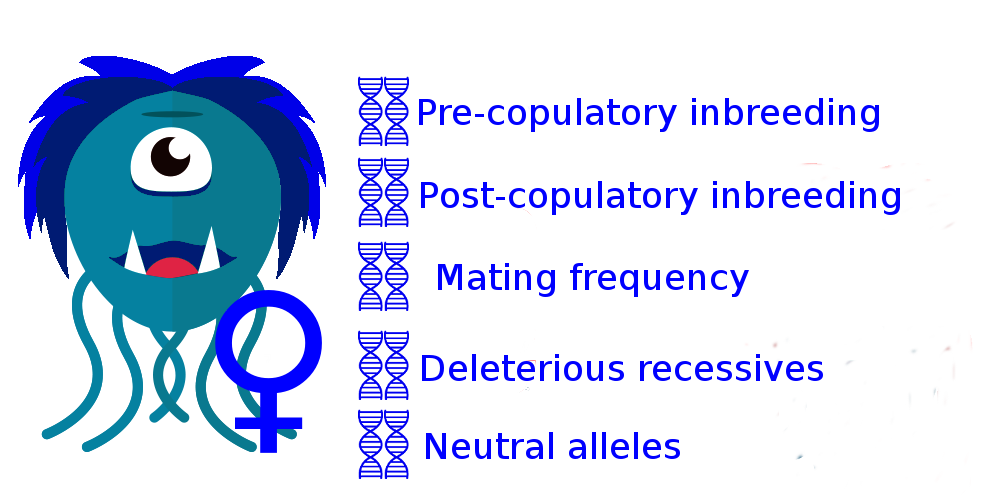
</center>


## General individual-based model overview

<center>

</center>

<span style="font-size: 18px;">
Code [available on GitHub](https://github.com/bradduthie/PolyInbreed)
</span>

## General individual-based model overview

<center>

</center>

<span style="font-size: 18px;">
Code [available on GitHub](https://github.com/bradduthie/PolyInbreed)
</span>

## General individual-based model overview

<center>

</center>

<span style="font-size: 18px;">
Code [available on GitHub](https://github.com/bradduthie/PolyInbreed)
</span>

## General individual-based model overview

<center>

</center>

<span style="font-size: 18px;">
Code [available on GitHub](https://github.com/bradduthie/PolyInbreed)
</span>

## General individual-based model overview

<center>

</center>

<span style="font-size: 18px;">
Code [available on GitHub](https://github.com/bradduthie/PolyInbreed)
</span>

## General individual-based model overview

<center>

</center>

<span style="font-size: 18px;">
Code [available on GitHub](https://github.com/bradduthie/PolyInbreed)
</span>

## General individual-based model overview

<center>

</center>

<span style="font-size: 18px;">
Code [available on GitHub](https://github.com/bradduthie/PolyInbreed)
</span>

## General individual-based model overview

<center>

</center>

<span style="font-size: 18px;">
Code [available on GitHub](https://github.com/bradduthie/PolyInbreed)
</span>

##

```{r, echo = FALSE, fig.width = 4}
inputPanel(
  sliderInput("Imm", label = "Immigrants", width="100%",
              min = 0.0, max = 10, value = 0, step = 1), 
  sliderInput("ID", label = "Inbreeding Depression", width="100%",
              min = 0.0, max = 10, value = 0, step = 0.5), 
  sliderInput("cost", label = "Strategy Cost", width="100%",
              min = 0.0, max = 0.1, value = 0, step = 0.01), 
  sliderInput("mu", label = "Mutation Rate", width="100%",
              min = 0.0, max = 0.1, value = 0, step = 0.01), 
  actionButton("mate", "New Generation"),
  actionButton("reset", "Reset")
)

gen     <- reactiveValues();
iter    <- reactiveValues();
mtt     <- reactiveValues();

gen$dat  <- list(ID = NULL, Rmat = NULL, lgn = NULL);
iter$all <- 0;
iter$nue <- 0;
iter$kva <- 0;
iter$mkv <- 0;
mtt$dat  <- NULL;

Ds    <- observeEvent(input$mate, {
        if( is.null(gen$dat$ID) == TRUE | is.null(gen$dat$ID) == TRUE){
            gen$dat$ID   <- initialise_inds(N = 80);
            gen$dat$Rmat <- initialise_Rmat(gen$dat$ID);
        }else{
            gen$dat  <- new_gen(ID = gen$dat$ID, Rmat = gen$dat$Rmat, 
                                Kf = 40, Km = 40, beta = input$ID, 
                                imm = input$Imm, cost = input$cost, 
                                mu = input$mu);
            iter$all <- c(iter$all, mean(gen$dat$ID[,11:20]));
            iter$nue <- c(iter$nue, mean(gen$dat$ID[,21:30]));
            kvalues  <- gen$dat$Rmat;
            kvalues  <- kvalues[,-1];
            if(dim(kvalues)[1] > 80){
                kvalues <- kvalues[1:80, 1:80];
            }
            diag(kvalues) <- NA ;#diag(kvalues) * 0.5;
            iter$kva <- kvalues;
            iter$mkv <- c(iter$mkv, mean(kvalues, na.rm = TRUE));
            mtID     <- gen$dat$last_gen;
            mtt$dat  <- mate_connect(mtID);
        }
})

rs    <- observeEvent(input$reset, {
       gen$dat <- list(ID = NULL, Rmat = NULL);
       iter$all <- 0;
       iter$nue <- 0;
       iter$kva <- 0;
       iter$mkv <- 0;
})

renderPlot({
  par(bg = 'transparent');
  malle <- iter$all;
  mneut <- iter$nue
  mkval <- iter$mkv
  gens  <- 1:length(iter$all);
  if(length(gens) < 6){
      par(mfrow = c(1, 2));
      if(length(gens) > 1){
          dat <- mtt$dat;
          femrow <- 1:sum(dat[,2] > 0);
          malrow <- (sum(dat[,2] > 0) + 1):dim(dat)[1];
          plot(x = dat[, 5], y = dat[, 6], pch = 15, col = "blue", cex = 1.25,
               xlim = c(-2, 2), ylim = c(-2, 2), xaxt = "n", yaxt = "n", xlab = "",
               ylab = "", type = "n", bty = "n");
          text(x = -2, y = -2, pos = 4, col = "red", labels = "Males", cex = 1.75);
          text(x = -2, y =  2, pos = 4, col = "blue", labels = "Females", cex = 1.75);
          arrows(x0 = dat[femrow,5], x1 = dat[femrow,7], y0 = dat[femrow,6], 
              y1 = dat[femrow,8], length = 0, lwd = 2);
          points(x = dat[femrow, 5], y = dat[femrow, 6], pch = 15, col = "blue", cex = 1.25);
          points(x = dat[malrow, 5], y = dat[malrow, 6], pch = 16, col = "red", cex = 1.25);
          plot(x = 0:5, y = 0:5, type = "n", ylim = c(0, 1), cex.axis = 1.5,
               cex.lab = 1.5, xlab = "Generation", ylab = "Mean Kinship", 
               bg = "transparent");
          points(x = gens, y = mkval, pch = 20, cex = 1.5, type = "b",
                 lwd = 2, col = "black");
      }else{
          plot.new();
      }
  }else{
      par(mfrow = c(1, 2));
      dat <- mtt$dat;
      femrow <- 1:sum(dat[,2] > 0);
      malrow <- (sum(dat[,2] > 0) + 1):dim(dat)[1];
      plot(x = dat[, 5], y = dat[, 6], pch = 15, col = "blue", cex = 1.25,
           xlim = c(-2, 2), ylim = c(-2, 2), xaxt = "n", yaxt = "n", xlab = "",
           ylab = "", type = "n", bty = "n");
           arrows(x0 = dat[femrow,5], x1 = dat[femrow,7], y0 = dat[femrow,6], 
           y1 = dat[femrow,8], length = 0, lwd = 2);
      text(x = -2, y = -2, pos = 4, col = "red", labels = "Males", cex = 1.75);
      text(x = -2, y =  2, pos = 4, col = "blue", labels = "Females", cex = 1.75);
      points(x = dat[femrow, 5], y = dat[femrow, 6], pch = 15, col = "blue", cex = 1.25);
      points(x = dat[malrow, 5], y = dat[malrow, 6], pch = 15, col = "red", cex = 1.25);
      x0 <- length(gens) - 5;
      x1 <- length(gens) + 0;
      plot(x = x0:x1, y = 0:5, type = "n", ylim = c(0, 1), cex.axis = 1.5,
           cex.lab = 1.5, xlab = "Generation", ylab = "Mean Kinship", 
           bg = "transparent");
      points(x = gens, y = mkval, pch = 20, cex = 1.5, type = "b",
                 lwd = 2, col = "black");
  }
})
```

##

```{r, echo = FALSE, fig.width = 4}
inputPanel(
  sliderInput("Imm3", label = "Immigrants", width="100%",
              min = 0.0, max = 10, value = 0, step = 1), 
  sliderInput("ID3", label = "Inbreeding Depression", width="100%",
              min = 0.0, max = 10, value = 0, step = 0.5), 
  sliderInput("cost3", label = "Strategy Cost", width="100%",
              min = 0.0, max = 0.1, value = 0, step = 0.01), 
  sliderInput("mu3", label = "Mutation Rate", width="100%",
              min = 0.0, max = 0.1, value = 0, step = 0.01), 
  actionButton("mate3", "New Generation"),
  actionButton("reset3", "Reset")
)

gen     <- reactiveValues();
iter    <- reactiveValues();

gen$dat  <- list(ID = NULL, Rmat = NULL);
iter$all <- 0;
iter$nue <- 0;
iter$kva <- 0;
iter$mkv <- 0;

Ds    <- observeEvent(input$mate3, {
        if( is.null(gen$dat$ID) == TRUE | is.null(gen$dat$ID) == TRUE){
            gen$dat$ID   <- initialise_inds(N = 80);
            gen$dat$Rmat <- initialise_Rmat(gen$dat$ID);
        }else{
            gen$dat  <- new_gen(ID = gen$dat$ID, Rmat = gen$dat$Rmat, 
                                Kf = 40, Km = 40, beta = input$ID3, 
                                imm = input$Imm3, cost = input$cost3, 
                                mu = input$mu3);
            iter$all <- c(iter$all, mean(gen$dat$ID[,11:20]));
            iter$nue <- c(iter$nue, mean(gen$dat$ID[,21:30]));
            kvalues  <- gen$dat$Rmat;
            kvalues  <- kvalues[,-1];
            if(dim(kvalues)[1] > 80){
                kvalues <- kvalues[1:80, 1:80];
            }
            diag(kvalues) <- NA ;#diag(kvalues) * 0.5;
            iter$kva <- kvalues;
            iter$mkv <- c(iter$mkv, mean(kvalues, na.rm = TRUE));
        }
})

rs    <- observeEvent(input$reset3, {
       gen$dat <- list(ID = NULL, Rmat = NULL);
       iter$all <- 0;
       iter$nue <- 0;
       iter$kva <- 0;
       iter$mkv <- 0;
})

renderPlot({
  par(bg = 'transparent');
  malle <- iter$all;
  mneut <- iter$nue
  mkval <- iter$mkv
  gens  <- 1:length(iter$all);
  if(length(gens) < 6){
      par(mfrow = c(1, 2));
      if(length(gens) > 0){
          par(mar = c(7, 5, 5, 5));
          hist(iter$kva, xlim = c(0, 1), ylim = c(0, 20), freq = FALSE, col = "black",
               yaxt = "n", ylab = "", main = "", xlab = "", 
               breaks = seq(from = 0, to = 1, by = 0.05), cex.axis = 1.5);
          title(xlab = "Kinship (k)", line = 4, cex.axis = 1.5, cex.lab = 1.5);
          box(lwd = 3);
          plot(x = 0:5, y = 0:5, type = "n", ylim = c(0, 1), cex.axis = 1.5,
               cex.lab = 1.5, xlab = "Generation", ylab = "Mean Kinship", 
               bg = "transparent");
          points(x = gens, y = mkval, pch = 20, cex = 1.5, type = "b",
                 lwd = 2, col = "black");
      }else{
          plot.new();
      }
  }else{
      x0 <- length(gens) - 5;
      x1 <- length(gens) + 0;
      par(mfrow = c(1, 2), mar = c(7, 5, 5, 5));
      hist(iter$kva, xlim = c(0, 1), ylim = c(0, 20), freq = FALSE, col = "black",
           yaxt = "n", ylab = "", main = "", xlab = "", 
           breaks = seq(from = 0, to = 1, by = 0.05), cex.axis = 1.5);
      title(xlab = "Kinship (k)", line = 4, cex.axis = 1.5, cex.lab = 1.5);
      box(lwd = 3);
      plot(x = x0:x1, y = 0:5, type = "n", ylim = c(0, 1), cex.axis = 1.5,
           cex.lab = 1.5, xlab = "Generation", ylab = "Mean Kinship", 
           bg = "transparent");
      points(x = gens, y = mkval, pch = 20, cex = 1.5, type = "b",
                 lwd = 2, col = "black");
  }
})
```


## Simulated kinships vs. Mandarte song sparrows

<div class = "columns-2">

<br>

```{r, echo = FALSE, fig.width = 4}
renderPlot({
  par(bg = 'transparent');
  malle <- iter$all;
  mneut <- iter$nue
  mkval <- iter$mkv
  gens  <- 1:length(iter$all);
  par(mar = c(7, 5, 5, 5));
  hist(iter$kva, xlim = c(0, 1), ylim = c(0, 20), freq = FALSE, col = "black",
        yaxt = "n", ylab = "", main = "", xlab = "", 
        breaks = seq(from = 0, to = 1, by = 0.05), cex.axis = 1.5);
  title(xlab = "Kinship (k)", line = 4, cex.axis = 1.5, cex.lab = 1.5);
  box(lwd = 3);
})
```

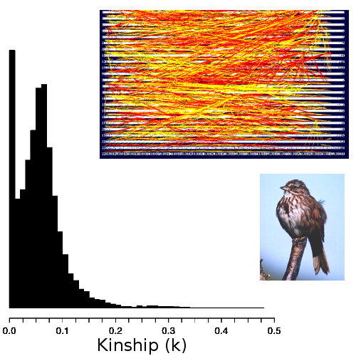

</div>

##

```{r, echo = FALSE, fig.width = 4}
inputPanel(
  sliderInput("Imm2", label = "Immigrants", width="100%",
              min = 0.0, max = 10, value = 2, step = 1), 
  sliderInput("ID2", label = "Inbreeding Depression", width="100%",
              min = 0.0, max = 10, value = 8, step = 0.5), 
  sliderInput("cost2", label = "Strategy Cost", width="100%",
              min = 0.0, max = 0.1, value = 0, step = 0.01), 
  sliderInput("mu2", label = "Mutation Rate", width="100%",
              min = 0.0, max = 0.1, value = 0, step = 0.01), 
  actionButton("mate2", "New Generation"),
  actionButton("reset2", "Reset")
)

gen     <- reactiveValues();
iter    <- reactiveValues();

gen$dat  <- list(ID = NULL, Rmat = NULL);
iter$all <- 0;
iter$nue <- 0;
iter$kva <- 0;
iter$mkv <- 0;

Ds    <- observeEvent(input$mate2, {
        if( is.null(gen$dat$ID) == TRUE | is.null(gen$dat$ID) == TRUE){
            gen$dat$ID   <- initialise_inds(N = 80);
            gen$dat$Rmat <- initialise_Rmat(gen$dat$ID);
        }else{
            gen$dat  <- new_gen(ID = gen$dat$ID, Rmat = gen$dat$Rmat, 
                                Kf = 40, Km = 40, beta = input$ID2, 
                                imm = input$Imm2, cost = input$cost2, 
                                mu = input$mu2);
            iter$all <- c(iter$all, mean(gen$dat$ID[,11:20]));
            iter$nue <- c(iter$nue, mean(gen$dat$ID[,21:30]));
            kvalues  <- gen$dat$Rmat;
            kvalues  <- kvalues[,-1];
            if(dim(kvalues)[1] > 80){
                kvalues <- kvalues[1:80, 1:80];
            }
            diag(kvalues) <- NA ;#diag(kvalues) * 0.5;
            iter$kva <- kvalues;
            iter$mkv <- c(iter$mkv, mean(kvalues, na.rm = TRUE));
        }
})

rs    <- observeEvent(input$reset2, {
       gen$dat <- list(ID = NULL, Rmat = NULL);
       iter$all <- 0;
       iter$nue <- 0;
       iter$kva <- 0;
       iter$mkv <- 0;
})

renderPlot({
  par(bg = 'transparent');
  malle <- iter$all;
  mneut <- iter$nue
  gens  <- 1:length(iter$all);
  if(length(gens) < 6){
      par(mfrow = c(1, 2));
      plot(x = 0:5, y = 0:5, type = "n", ylim = c(-1, 1), cex.axis = 1.5,
           cex.lab = 1.5, xlab = "Generation", ylab = "Inbreeding strategy", 
           bg = "transparent");
      abline(h = 0, lty = "dotted", lwd = 0.8);
      polygon(x=c(-0.125, 2.65, 2.65, -0.125), y=c(0.825, 0.825, 1.1, 1.1), 
              border=NA, col="black");
      polygon(x=c(-0.125, 2.65, 2.65, -0.125), y=c(-0.825, -0.825, -1.1, -1.1), 
              border=NA, col="black");
      abline(v = -0.125, lwd = 4);
      text(x = 0, y = 0.95, labels = "Inbreeding Preference", cex = 1.5, 
           col = "white", pos = 4);
      text(x = 0, y = -0.95, labels = "Inbreeding Avoidance", cex = 1.5, 
           col = "white", pos = 4);
      if(length(gens) > 0){
          points(x = gens, y = malle, pch = 20, cex = 1.5, type = "b",
                 lwd = 2, col = "black");
          par(mar = c(7, 5, 5, 5));
          hist(iter$kva, xlim = c(0, 1), ylim = c(0, 20), freq = FALSE, col = "black",
               yaxt = "n", ylab = "", main = "", xlab = "", 
               breaks = seq(from = 0, to = 1, by = 0.05), cex.axis = 1.5);
          title(xlab = "Kinship (k)", line = 4, cex.axis = 1.5, cex.lab = 1.5);
          box(lwd = 3);
      }
  }else{
      x0 <- length(gens) - 5;
      x1 <- length(gens) + 0;
      par(mfrow = c(1, 2));
      plot(x = x0:x1, y = 0:5, type = "n", ylim = c(-1, 1), cex.axis = 1.5,
           cex.lab = 1.5, xlab = "Generation", ylab = "Inbreeding strategy", 
           bg = "transparent");
      abline(h = 0, lty = "dotted", lwd = 0.8);
      polygon(x=c(x0-0.125, x0+2.65, x0+2.65, x0-0.125), 
              y=c(0.825, 0.825, 1.1, 1.1), border=NA, col="black");
      polygon(x=c(x0-0.125, x0+2.65, x0+2.65, x0-0.125), 
              y=c(-0.825, -0.825, -1.1, -1.1), border=NA, col="black");
      abline(v = x0-0.125, lwd = 4);
      text(x = x0, y = 0.95, labels = "Inbreeding Preference", cex = 1.5, 
           col = "white", pos = 4);
      text(x = x0, y = -0.95, labels = "Inbreeding Avoidance", cex = 1.5, 
           col = "white", pos = 4);
      points(x = gens, y = malle, pch = 20, cex = 1.5, type = "b",
                 lwd = 2, col = "black");
      par(mar = c(7, 5, 5, 5));
      hist(iter$kva, xlim = c(0, 1), ylim = c(0, 20), freq = FALSE, col = "black",
           yaxt = "n", ylab = "", main = "", xlab = "", 
           breaks = seq(from = 0, to = 1, by = 0.05), cex.axis = 1.5);
      title(xlab = "Kinship (k)", line = 4, cex.axis = 1.5, cex.lab = 1.5);
      box(lwd = 3);
  }
})
```

## Individual-based modelling questions

**When should we predict selection for alleles causing pre-copulatory inbreeding avoidance or inbreeding preference? [1]**

**Why should we predict females will mate multiply to adjust the degree to which they inbreed? [2]**

**How should we predict females to avoid inbreeding (pre- versus post-copulatory avoidance)? [3]**

<br><br><br><br>

<hr>
<span style="font-size: 18px;">
1. Duthie, AB & JM Reid (2016) *Am. Nat.* [**188**:651-667](https://bradduthie.github.io/Duthie_Reid2016.pdf). <br>
2. Duthie, AB et al. (2016) *Evolution* [**70**:1927-1943](https://bradduthie.github.io/DuthieEtAl2016b.pdf). <br>
3. Duthie, AB et al. (2018) *J. Evol. Biol.* [**31**:31-45](https://bradduthie.github.io/DuthieEtAl2017.pdf). <br>
</span>

## Mutant allele underlying inbreeding avoidance {.smaller}

<center>

</center>


## Mutant allele underlying inbreeding avoidance {.smaller}

<div class = "columns-2">


Compared frequency of a mutant allele underlying inbreeding avoidance to a mutant neutral allele after 3000 generations. 

**100 simulation replicates across multiple parameter values:**

1. Selection against deleterious recessives
2. Direct selection against inbreeding avoidance
3. Kin discrimination ability (all vs. only sibs)
4. Effect strength of inbreeding avoidance allele
5. Female and male carrying capacity
6. Dominance coefficient of deleterious recessives
7. Offspring produced per female
8. Maximum mates per male
9. Immigrants per generation
10. Allele mutation rate (forward & back)

</div>
<span style="font-size: 18px;">
Duthie, AB & JM Reid (2016) *Am. Nat.* [**188**:651-667](https://bradduthie.github.io/Duthie_Reid2016_AppendixB.pdf). From [Appendix B](https://bradduthie.github.io/Duthie_Reid2016_AppendixB.pdf)
</span>

## Mutant allele underlying inbreeding avoidance {.smaller}

<div class = "columns-2">


Compared frequency of a mutant allele underlying inbreeding avoidance to a mutant neutral allele after 3000 generations. 

**100 simulation replicates across multiple parameter values:**

1. [Selection against deleterious recessives](https://bradduthie.github.io/Duthie_Reid2016.pdf#page=7)
2. [Direct selection against inbreeding avoidance](https://bradduthie.github.io/Duthie_Reid2016.pdf#page=7)
3. [Kin discrimination ability (all vs. only sibs)](https://bradduthie.github.io/Duthie_Reid2016_SM.pdf#page=11)
4. [Effect strength of inbreeding avoidance allele](https://bradduthie.github.io/Duthie_Reid2016_SM.pdf#page=19)
5. [Female and male carrying capacity](https://bradduthie.github.io/Duthie_Reid2016_SM.pdf#page=17)
6. Dominance coefficient of deleterious recessives
7. Offspring produced per female
8. Maximum mates per male
9. Immigrants per generation
10. Allele mutation rate (forward & back)


</div>
<span style="font-size: 18px;">
Duthie, AB & JM Reid (2016) *Am. Nat.* [**188**:651-667](https://bradduthie.github.io/Duthie_Reid2016_AppendixB.pdf). From [Appendix B](https://bradduthie.github.io/Duthie_Reid2016_AppendixB.pdf)
</span>

## Mutant allele underlying inbreeding avoidance {.smaller}

<div class = "columns-2">


Compared frequency of a mutant allele underlying inbreeding avoidance to a mutant neutral allele after 3000 generations. 

**100 simulation replicates across multiple parameter values:**

1. [Selection against deleterious recessives](https://bradduthie.github.io/Duthie_Reid2016.pdf#page=7)
2. [Direct selection against inbreeding avoidance](https://bradduthie.github.io/Duthie_Reid2016.pdf#page=7)
3. [Kin discrimination ability (all vs. only sibs)](https://bradduthie.github.io/Duthie_Reid2016_SM.pdf#page=11)
4. [Effect strength of inbreeding avoidance allele](https://bradduthie.github.io/Duthie_Reid2016_SM.pdf#page=19)
5. [Female and male carrying capacity](https://bradduthie.github.io/Duthie_Reid2016_SM.pdf#page=17)
6. Dominance coefficient of deleterious recessives
7. Offspring produced per female
8. Maximum mates per male
9. Immigrants per generation
10. Allele mutation rate (forward & back)

</div>
<span style="font-size: 18px;">
Duthie, AB & JM Reid (2016) *Am. Nat.* [**188**:651-667](https://bradduthie.github.io/Duthie_Reid2016_AppendixA.pdf). From [Appendix A](https://bradduthie.github.io/Duthie_Reid2016_AppendixA.pdf)
</span>

## Mutant allele underlying inbreeding avoidance

<div class = "columns-2">


<br><br><br><br><br><br><br><br>

</div>


## Mutant allele underlying inbreeding avoidance

<div class = "columns-2">

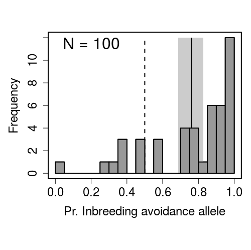

1000 loci with deleterious recessive alleles (homozygotes 2\% survival cost)

Inbreeding depression slope $\beta \approx 1$

$\delta \approx 0.22$ for offspring of full siblings

$\delta \approx 0.12$ for offspring of half siblings

$\delta \approx 0.06$ for offspring of first cousins


</div>
<span style="font-size: 18px;">
Duthie, AB & JM Reid (2016) *Am. Nat.* [**188**:651-667](https://bradduthie.github.io/Duthie_Reid2016).
</span>


## Mutant allele underlying inbreeding avoidance

<div class = "columns-2">


**Selection for inbreeding avoidance is no longer predicted given a direct fitness cost of 1% for carrying the allele.**

</div>
<span style="font-size: 18px;">
Duthie, AB & JM Reid (2016) *Am. Nat.* [**188**:651-667](https://bradduthie.github.io/Duthie_Reid2016.pdf).
</span>

## Mutant allele underlying inbreeding avoidance

<div class = "columns-2">

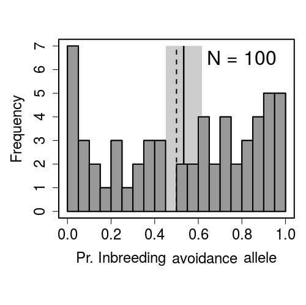

Selection for inbreeding avoidance is no longer predicted given a direct fitness cost of 1% for carrying the allele.

**Selection for inbreeding avoidance was limited when females could only identify siblings as kin.**

</div>
<span style="font-size: 18px;">
Duthie, AB & JM Reid (2016) *Am. Nat.* [**188**:651-667](https://bradduthie.github.io/Duthie_Reid2016.pdf). 
</span>

## Mutant allele underlying inbreeding avoidance

<div class = "columns-2">

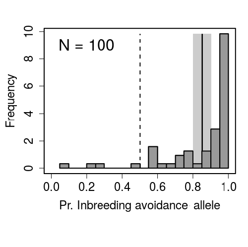

Selection for inbreeding avoidance is no longer predicted given a direct fitness cost of 1% for carrying the allele.

Selection for inbreeding avoidance was limited when females could only identify siblings as kin.

**Selection for inbreeding avoidance increases when the *effect* of the allele is strengthened (i.e., relatives are avoided at higher probability).**

</div>
<span style="font-size: 18px;">
Duthie, AB & JM Reid (2016) *Am. Nat.* [**188**:651-667](https://bradduthie.github.io/Duthie_Reid2016.pdf). 
</span>


## Mutant allele underlying inbreeding avoidance

<div class = "columns-2">

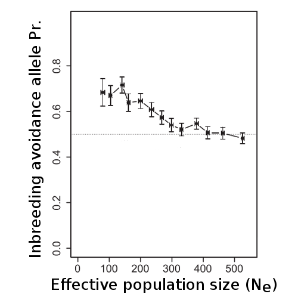

Selection for inbreeding avoidance is no longer predicted given a direct fitness cost of 1% for carrying the allele.

Selection for inbreeding avoidance was limited when females could only identify siblings as kin.

Selection for inbreeding avoidance increases when the *effect* of the allele is strengthened (i.e., relatives are avoided at higher probability).

**Selection was stronger at *lower* N<sub>e</sub> due to *increased* inbreeding risk.**

</div>
<span style="font-size: 18px;">
Duthie, AB & JM Reid (2016) *Am. Nat.* [**188**:651-667](https://bradduthie.github.io/Duthie_Reid2016.pdf). 
</span>


## Mutant allele underlying inbreeding preference

<div class = "columns-2">


1000 loci with deleterious recessive alleles (homozygotes 0.4\% survival cost)

Inbreeding depression slope $\beta \approx 0.5$

$\delta \approx 0.12$ for offspring of full siblings

$\delta \approx 0.06$ for offspring of half siblings

$\delta \approx 0.03$ for offspring of first cousins

</div>
<span style="font-size: 18px;">
Duthie, AB & JM Reid (2016) *Am. Nat.* [**188**:651-667](https://bradduthie.github.io/Duthie_Reid2016).
</span>


## Population genetic model conclusions

**Overall, selection for a mutant allele underlying inbreeding avoidance:**

1. **Increased** given [stronger selection against deleterious recessives](https://bradduthie.github.io/Duthie_Reid2016.pdf#page=7)
2. **Decreased** given [direct selection against inbreeding avoidance](https://bradduthie.github.io/Duthie_Reid2016.pdf#page=7)
3. **Decreased** given restricted [kin discrimination ability (all vs. only sibs)](https://bradduthie.github.io/Duthie_Reid2016_SM.pdf#page=11)
4. **Increased** given an increasing [effect strength of inbreeding avoidance allele](https://bradduthie.github.io/Duthie_Reid2016_SM.pdf#page=19)
5. **Decreased** given increased [female and male carrying capacity](https://bradduthie.github.io/Duthie_Reid2016_SM.pdf#page=17) (and consequent increase in effective population size)

<br><br><br><br>

</div>
<span style="font-size: 18px;">
Duthie, AB & JM Reid (2016) *Am. Nat.* [**188**:651-667](https://bradduthie.github.io/Duthie_Reid2016).
</span>


## Population genetic model conclusions

**Additional conclusions:**

- [Comparable selection](https://bradduthie.github.io/Duthie_Reid2016_SM.pdf\page=11) for inbreeding avoidance alleles was observed when males chose (*note*, males were mate limited when choosing).
- Weak inbreeding depression caused selection for inbreeding preference when *females* chose, but not when *males* chose mates.
- [No evidence of purging](https://bradduthie.github.io/Duthie_Reid2016_SM.pdf#page=5) in simulations with mutant alleles underlying inbreeding avoidance or preference.

<br><br><br><br><br>

</div>
<span style="font-size: 18px;">
Duthie, AB & JM Reid (2016) *Am. Nat.* [**188**:651-667](https://bradduthie.github.io/Duthie_Reid2016).
</span>

## Multi-locus model with infinite alleles

<center>

</center>

## Multi-locus model with infinite alleles

<center>


</center>


## Multi-locus model with infinite alleles

<center>

</center>


## Multi-locus model with infinite alleles

<div class = "columns-2">

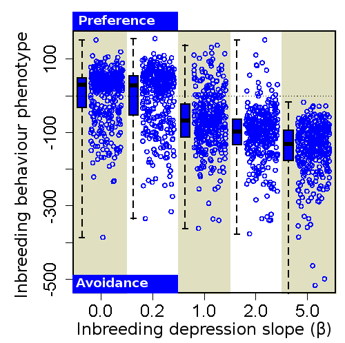

<br><br><br><br>

High variation of inbreeding behaviour across inbreeding depression slopes.

</div>

<span style="font-size: 18px;">
Duthie, AB et al. (2016) *Evolution* [**70**:1927-1943](https://bradduthie.github.io/DuthieEtAl2016b.pdf).
</span>


## Selection against inbreeding

<div class = "columns-2">

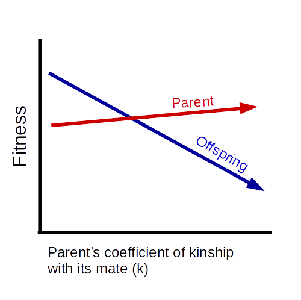

<br><br><br><br>

Selection against being inbred does not necessarily imply selection against inbreeding

</div>

<span style="font-size: 18px;">
Reid, JM et al. (2015). *Evolution* [69:2846-2861](https://doi.org/10.5061/dryad.0015b).
</span>

## Inbreeding adjustment through multiple mating {.smaller}

<center>


</center>

## Inbreeding adjustment through multiple mating {.smaller}

<center>


</center>

## Inbreeding adjustment through multiple mating {.smaller}

<center>


</center>

## Inbreeding adjustment through multiple mating {.smaller}

<center>


</center>


## Inbreeding adjustment through multiple mating {.smaller}

<center>


</center>

## Inbreeding adjustment through multiple mating {.smaller}

<center>


</center>

## Inbreeding adjustment through multiple mating {.smaller}

<center>


</center>

## Inbreeding adjustment through multiple mating {.smaller}

<center>


</center>

## Inbreeding adjustment through multiple mating {.smaller}

<center>


</center>

## Inbreeding adjustment through multiple mating {.smaller}

<center>


</center>

## Inbreeding adjustment through multiple mating {.smaller}

<center>


</center>


## Inbreeding adjustment through multiple mating {.smaller}

<center>
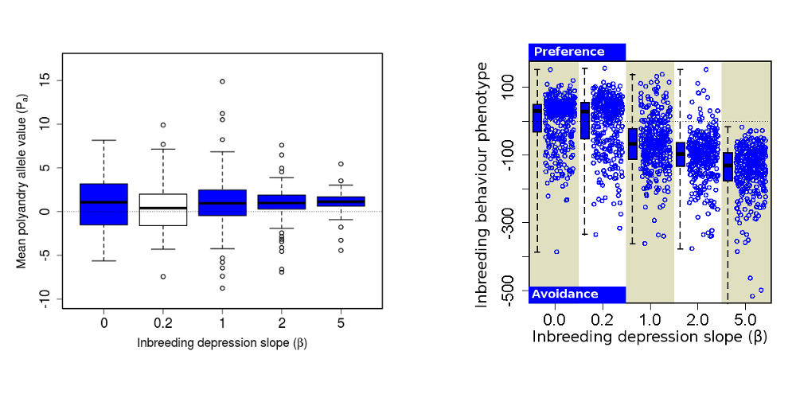

</center>

<span style="font-size: 18px;">
Duthie, AB et al. (2016) *Evolution* [**70**:1927-1943](https://bradduthie.github.io/DuthieEtAl2016b.pdf).
</span>

## Inbreeding adjustment through multiple mating {.smaller}

<center>


</center>

<span style="font-size: 18px;">
Duthie, AB et al. (2016) *Evolution* [**70**:1927-1943](https://bradduthie.github.io/DuthieEtAl2016b.pdf).
</span>

## Inbreeding adjustment through multiple mating {.smaller}

<center>


</center>

## Inbreeding adjustment through multiple mating {.smaller}

<center>


</center>

<span style="font-size: 18px;">
Duthie, AB et al. (2016) *Evolution* [**70**:1927-1943](https://bradduthie.github.io/DuthieEtAl2016b.pdf).
</span>


## Inbreeding adjustment conclusions

1. Selection for females to increase or decrease pre-copulatory inbreeding through multiple mating, [depending on inbreeding depression](https://bradduthie.github.io/DuthieEtAl2016b.pdf#page=11) ($\beta$).
2. Realised inbreeding adjustment ($k_{adj}$) often [small and difficult to detect](https://bradduthie.github.io/DuthieEtAl2016b.pdf#page=11).

<br><br><br><br><br><br><br><br><br><br><br>

</div>
<span style="font-size: 18px;">
Duthie, AB et al. (2016) *Evolution* [**70**:1927-1943](https://bradduthie.github.io/DuthieEtAl2016b.pdf).
</span>


## Post-copulatory inbreeding avoidance {.smaller}

<center>


</center>

## Effect of post-copulatory selection on polyandry {.smaller}

<center>


</center>

<br>

<span style="font-size: 18px;">
Duthie, AB et al. (2018) *J. Evol. Biol.* [**31**:31-45](https://bradduthie.github.io/DuthieEtAl2017.pdf).
</span>

## Effect of post-copulatory selection on polyandry {.smaller}

<center>


</center>

<br>

<span style="font-size: 18px;">
Duthie, AB et al. (2018) *J. Evol. Biol.* [**31**:31-45](https://bradduthie.github.io/DuthieEtAl2017.pdf).
</span>

## Effect of post-copulatory selection on polyandry {.smaller}

<center>


</center>

<br>

<span style="font-size: 18px;">
Duthie, AB et al. (2018) *J. Evol. Biol.* [**31**:31-45](https://bradduthie.github.io/DuthieEtAl2017.pdf).
</span>

## Effect of post-copulatory selection on polyandry {.smaller}

<center>

</center>

<br>

<span style="font-size: 18px;">
Duthie, AB et al. (2018) *J. Evol. Biol.* [**31**:31-45](https://bradduthie.github.io/DuthieEtAl2017.pdf).
</span>

## Post-copulatory inbreeding avoidance conclusions

1. Post-copulatory inbreeding avoidance can [greatly strengthen for polyandry](https://bradduthie.github.io/DuthieEtAl2017.pdf#page=8)
2. How inbreeding is avoided is affected by the [relative cost of pre-copulatory versus post-copulatory choice](https://bradduthie.github.io/DuthieEtAl2017.pdf#page=10)

<br><br><br><br><br><br><br><br><br>

<span style="font-size: 18px;">
Duthie, AB et al. (2018) *J. Evol. Biol.* [**31**:31-45](https://bradduthie.github.io/DuthieEtAl2017.pdf).
</span>


## Individual-based models: general conclusions {.smaller}

**When should we predict selection for alleles causing pre-copulatory inbreeding avoidance or inbreeding preference? [1]**

- Inbreeding depression strong (avoidance) or very weak (preference)
- Low direct costs of non-random mating
- Small population size where risk of inbreeding is high

<br><br><br><br>

<br><br><br><br>

<hr>
<span style="font-size: 18px;">
1. Duthie, AB & JM Reid (2016) *Am. Nat.* [**188**:651-667](https://bradduthie.github.io/Duthie_Reid2016.pdf). <br>
</span>


## Individual-based models: general conclusions {.smaller}

**When should we predict selection for alleles causing pre-copulatory inbreeding avoidance or inbreeding preference? [1]**

- Inbreeding depression strong (avoidance) or very weak (preference)
- Low direct costs of non-random mating
- Small population size where risk of inbreeding is high

**Why should we predict females will mate multiply to adjust the degree to which they inbreed? [2]**

- Strong constraints on initial mate choice
- Opportunity for post-copulatory inbreeding adjustment

<br><br><br><br>

<hr>
<span style="font-size: 18px;">
1. Duthie, AB & JM Reid (2016) *Am. Nat.* [**188**:651-667](https://bradduthie.github.io/Duthie_Reid2016.pdf). <br>
2. Duthie, AB et al. (2016) *Evolution* [**70**:1927-1943](https://bradduthie.github.io/DuthieEtAl2016b.pdf). <br>
</span>


## Individual-based models: general conclusions {.smaller}

**When should we predict selection for alleles causing pre-copulatory inbreeding avoidance or inbreeding preference? [1]**

- Inbreeding depression strong (avoidance) or very weak (preference)
- Low direct costs of non-random mating
- Small population size where risk of inbreeding is high

**Why should we predict females will mate multiply to adjust the degree to which they inbreed? [2]**

- Strong constraints on initial mate choice
- Opportunity for post-copulatory inbreeding adjustment

**How should we predict females to avoid inbreeding (pre- versus post-copulatory avoidance)? [3]**

- Selection for less costly way to avoid inbreeding
- Polyandry modulates importance of pre-copulatory versus post-copulatory inbreeding avoidance

<hr>
<span style="font-size: 18px;">
1. Duthie, AB & JM Reid (2016) *Am. Nat.* [**188**:651-667](https://bradduthie.github.io/Duthie_Reid2016.pdf). <br>
2. Duthie, AB et al. (2016) *Evolution* [**70**:1927-1943](https://bradduthie.github.io/DuthieEtAl2016b.pdf). <br>
3. Duthie, AB et al. (2018) *J. Evol. Biol.* [**31**:31-45](https://bradduthie.github.io/DuthieEtAl2017.pdf). <br>
</span>


## Modulating parental investment and inbreeding


<div align="left" style="line-height: 0.6em;">
<span style="font-size: 14px;">
1. [Wibowo Djatmiko](https://commons.wikimedia.org/wiki/User:Wie146). 2. [George Shuklin](https://commons.wikimedia.org/wiki/User:George_Shuklin). 3. [Natalie Pilakouta](https://www.nataliepilakouta.com/). 4. [Neale Monks](https://en.wikipedia.org/wiki/User:Neale_Monks). 5. [Jane Reid](https://www.abdn.ac.uk/ibes/profiles/jane.reid). 6. [André Karwath](https://commons.wikimedia.org/wiki/User:Aka). <br> 7. [Benjamin Twist](https://commons.wikimedia.org/wiki/User:Benjamint444) (benjamint444@gmail.com) 8. [Heinz Seehagel](https://de.wikipedia.org/wiki/Benutzer:HaSee). 9. [Adam Hayward](https://adhayward.wordpress.com/)
</span></div>

## What parental investment is, specifically

**Anything that a parent does to increase its offspring's viability *at the expense of its other actual or potential offspring*** [1]


<br><br><br>

(Includes, but is not limited to, behaviour)

<br><br><br><br><br><br>

<hr>
<span style="font-size: 18px;">
1. Trivers R. (1974) *Am. Zool.* [**14**:249–264](https://doi.org/10.1093/icb/14.1.249) <br>
</span>

## Why parental investment is important

<div class = "columns-2">

- Models of inbreeding assume no concurrent modulation of parental investment or offspring production

- Parents might be able to increase the viability of their inbred offspring through parental investment [1]

- Parents are more closely related to inbred offspring than outbred offspring


</div>
<br>
<hr>
<span style="font-size: 18px;">
1. Pilakouta, N et al. (2015) *PNAS* [**112**:201500658](http://www.pnas.org/content/112/26/8031). <br>
</span>


## Parental investment and offspring number

<div class = "columns-2">
```{r, echo = FALSE, fig.width = 5}
M <- 10;
m <- seq(from = 0, to = 4, by = 0.1);
n <- M/m;
par(mar = c(5, 5, 1, 1));
plot(x = m, y = n, type = "l", lwd = 3, cex.lab = 1.5, cex.axis = 1.5,
     xlab = "Parental investment (m)", ylab = "Offspring produced (n)",
     ylim = c(0, 20));
text(x = 3.25, y = 16, labels = expression(paste(n == frac(M,m))), cex = 2.5);
```

- Offspring produced (n) decreases with investment per offspring (m)

</div>

## Parental investment and offspring number

<div class = "columns-2">
```{r, echo = FALSE, fig.width = 5}
V <- 1 * (1 - exp(-1 * (m - 1)));
V[V<0] <- NA;
par(mar = c(5, 5, 1, 1));
plot(x = m, y = V, type = "l", lwd = 3, cex.lab = 1.5, cex.axis = 1.5,
     xlab = "Parental investment (m)", 
     ylab = expression(paste("Offspring viability (",upsilon,")")),
     ylim = c(0, 1));
text(x = 1.2, y = 0.9, labels = expression(upsilon == 1 - e^{-c(m - m[min])}), 
     cex = 1.75);
```

- Offspring produced ($n$) decreases with investment per offspring ($m$)
- Offspring viability ($\upsilon$) increases with investment per offspring

</div>

## Parental investment and offspring number

<div class = "columns-2">
```{r, echo = FALSE, fig.width = 5}
V <- 1 * (1 - exp(-1 * (m - 1)));
V[V<0] <- NA;
par(mar = c(5, 5, 1, 1));
plot(x = m, y = V, type = "l", lwd = 3, cex.lab = 1.5, cex.axis = 1.5,
     xlab = "Parental investment (m)", 
     ylab = expression(paste("Offspring viability (",upsilon,")")),
     ylim = c(0, 1));
text(x = 1.2, y = 0.9, labels = expression(upsilon == 1 - e^{-c(m - m[min])}), 
     cex = 1.75);
abline(a = 0, b = 2*0.3410784 / 2.146197, lty = "dashed");
arrows(x0=2.146197,y0=0.3,x1=2.146197,y1=0,
       length = 0.15,angle=30,code=2,lwd=3);
text(x=2.146197,y=0.4,labels=expression(paste(italic(m)^"*")),cex=2);
```

- Offspring produced ($n$) decreases with investment per offspring ($m$)
- Offspring viability ($\upsilon$) increases with investment per offspring
- Highest rate of viable offspring production defines optimal parental investment ($m^{*}$)

## Parental investment and offspring number

<div class = "columns-2">
```{r, echo = FALSE, fig.width = 5}
V <- 1 * (1 - exp(-1 * (m - 1)));
V[V<0] <- NA;
par(mar = c(5, 5, 1, 1));
plot(x = m, y = V, type = "l", lwd = 3, cex.lab = 1.5, cex.axis = 1.5,
     xlab = "Parental investment (m)", 
     ylab = expression(paste("Offspring viability (",upsilon,")")),
     ylim = c(0, 1));
text(x = 1.2, y = 0.9, labels = expression(upsilon == 1 - e^{-c(m - m[min])}), 
     cex = 1.75);
abline(a = 0, b = 2*0.3410784 / 2.146197, lty = "dashed");
arrows(x0=2.146197,y0=0.3,x1=2.146197,y1=0,
       length = 0.15,angle=30,code=2,lwd=3);
text(x=2.146197,y=0.4,labels=expression(paste(italic(m)^"*")),cex=2);
```

- Offspring produced ($n$) decreases with investment per offspring ($m$)
- Offspring viability ($\upsilon$) increases with investment per offspring
- Highest rate of viable offspring production defines optimal parental investment ($m^{*}$)
- Optimally investing parents produce $W = n \times \upsilon^{*}$ offspring

</div>

## Synthesis of inbreeding and parental investment

<center>

</center>

<span style="font-size: 18px;">
1. Duthie, AB et al. (2016) *Proc. R. Soc. B* [**282**:20161845](https://bradduthie.github.io/DuthieEtAl2016c.pdf). <br>
</span>

## Synthesis of inbreeding and parental investment

<center>

</center>

<span style="font-size: 18px;">
1. Duthie, AB et al. (2016) *Proc. R. Soc. B* [**282**:20161845](https://bradduthie.github.io/DuthieEtAl2016c.pdf). <br>
</span>

## Synthesis of inbreeding and parental investment

<center>

</center>

<span style="font-size: 18px;">
1. Duthie, AB et al. (2016) *Proc. R. Soc. B* [**282**:20161845](https://bradduthie.github.io/DuthieEtAl2016c.pdf). <br>
</span>

## Synthesis of inbreeding and parental investment

<center>

</center>

<span style="font-size: 18px;">
1. Duthie, AB et al. (2016) *Proc. R. Soc. B* [**282**:20161845](https://bradduthie.github.io/DuthieEtAl2016c.pdf). [SI-1](https://bradduthie.github.io/DuthieEtAl2016c_SI.pdf) <br>
</span>

## Synthesis of inbreeding and parental investment

<center>

</center>


<span style="font-size: 18px;">
1. Duthie, AB et al. (2016) *Proc. R. Soc. B* [**282**:20161845](https://bradduthie.github.io/DuthieEtAl2016c.pdf). [SI-1](https://bradduthie.github.io/DuthieEtAl2016c_SI.pdf) <br>
</span>

##

```{r, echo=FALSE}
OffATr <- function(r, m, mmin=1, Beta=1, c=1){
    return( (1/2)*(1+r) * (1 - exp(-c*(m - mmin - Beta*r)) ));
}
# Below is fmd for analysis and plotting
OffATrd <- function(r, m, mmin=1, Beta=1, c=1){
    return(  0.5 * (1 + r) * (exp(-c * (m - mmin - Beta * r)) * c)  );
    # Also can simplify: return(  (c/2)*(1+r)*exp(-c*(m-mmin-Beta*r))  );
} # We'll need the above to find m^{*} and \gamma^{*} 
# To find m^{*}, can use the function below
findm <- function(low.guess,high.guess,rval,mmin=1,Beta=1,c=1){
  fm  <- function(m,r=rval){ 
           OffATrd(r=rval, mmin=mmin, Beta=Beta, m=m, c=c)*(0-m) + 
             OffATr(r=rval, mmin=mmin, Beta=Beta, m=m, c=c);
         }
  lg  <- fm(m=low.guess, r=rval);
  hg  <- fm(m=high.guess,r=rval);
  if(lg > 0){
    u <- low.guess;
    l <- high.guess;
  }else{
    u <- high.guess;
    l <- low.guess;
  }
  if((fm(l) > 0 & fm(u) > 0) | (fm(l) < 0 & fm(u) < 0)){
    return("Value of m is outside the range");
  }else{
    check  <- 1;
    mguess <- 0.5 * (l+u);
    i      <- 0;
    while(abs(check) > 0.000001 & i < 1000000){
        check <- fm(r=rval, m=mguess);
        if(check > 0){
          u      <- mguess;
          mguess <- 0.5*(l+mguess); 
        }else{
          l      <- mguess;
          mguess <- 0.5*(u+mguess);
        }
        i <- i+1;
    }
    return(mguess);
  }
} # Running the below returns the estimate
fmpl  <- expression(zeta[off] == frac(1,2)*(1+r)*(1-e^{(-c*(m-m[min]-beta*r))}));
inputPanel(
    
  sliderInput("rval", label = "Relatedness", width="100%",
              min = 0.0, max = 1, value = 0, step = 0.05), 
    
  sliderInput("cval", label = "PI curve", width="100%",
              min = 0.0, max = 3, value = 1, step=0.2),
  
  sliderInput("mmin", label = "Minimum m value", width="100%",
              min = 0.0, max = 2, value = 1, step = 0.1),
  
  sliderInput("Beta", label = "Inbreeding depression", 
              width="100%", min = 0.0, max = 5, value = 0, step = 0.2)
)

renderPlot({
  cc  <- as.numeric(input$cval);
  mm  <- as.numeric(input$mmin);
  bb  <- as.numeric(input$Beta);
  rr  <- as.numeric(input$rval);
  rmm <- findm(low.guess=0,high.guess=6,rval=rr,mmin=mm,Beta=bb,c=cc);
  mzt <- OffATr(r=rr, m=rmm, mmin=mm, Beta=bb, c=cc);
  rmg <- mzt / rmm;    
  PI  <- seq(from=0,to=4,by=0.01);
  All <- OffATr(r=rr, m=PI, mmin=mm, Beta=bb, c=cc);
  par(mar=c(5,5,2,2));
  plot(PI,All,type="l",lwd=4,ylim=c(0,1),
     xlab=expression(paste("Parental investment (",italic(m),")")),
     ylab=expression(paste("IBD alleles in offspring (",zeta[off],")")),
     cex.lab=1.5,cex.axis=1.5);
  abline(h=0,lty="dotted",lwd=0.8);
  abline(a=0,b=rmg,lty="solid", lwd=2,col="blue");
  arrows(x0=rmm,y0=mzt/2,x1=rmm,y1=0,length = 0.15,angle=30,code=2,lwd=3,col="blue");
  text(x=1,y=0.8,labels=fmpl,cex=2);
  text(x=rmm,y=0.5*mzt+0.07,labels=expression(paste(italic(m)^"*")),col="blue",cex=2);
  text(x=0.5,y=rmg*0.5+0.07,labels=expression(paste(italic(gamma^"*"))),
       srt=rmg,cex=2,col="blue");
})
```

## Acknowledgements


## General conclusions {.smaller}

**Predict selection for an allele causing inbreeding avoidance or preference when:**

- Inbreeding depression strong (avoidance) or very weak (preference)
- Low direct costs of non-random mating
- Small population size where risk of inbreeding is high

**Females should mate multiply to adjust inbreeding given:**

- Strong constraints on initial mate choice
- Opportunity for post-copulatory inbreeding adjustment

**Multiple factors affecting how to avoid inbreeding, including:**

- Direct costs on pre- versus post-copulatory inbreeding avoidance
- Polyandry modulates selection on pre- versus post-copulatory inbreeding avoidance

**Increased mate relatedness and inbreeding depression will cause optimal parental investment to increase**


